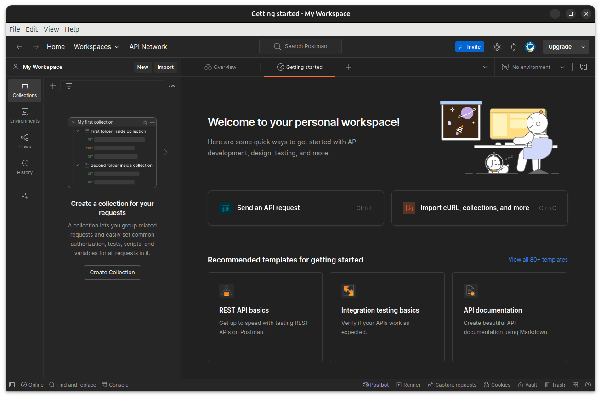
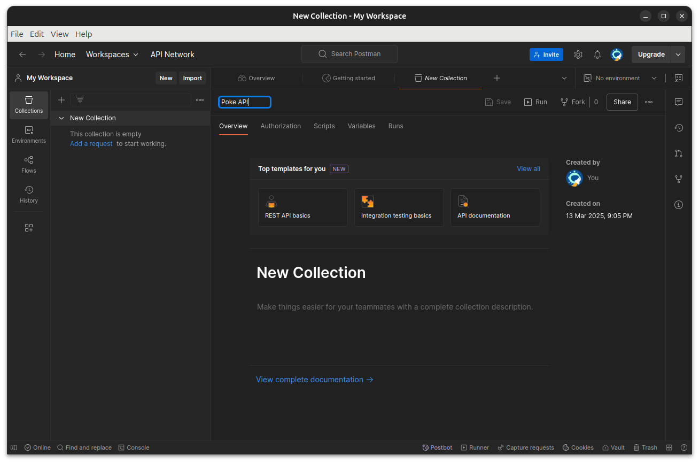

+++
title = "Api 1"
type = "chapter"
weight = 240
+++

## Competency and Learning Objectives

### Competency:

Working with APIs

### Learning Objectives:

- I can submit HTTP requests using the PostMan application

## Introduction

REST APIs (Application Programming Interfaces) are a way for different software applications to communicate with each
other over the internet.  REST stands for Representational State Transfer and is a set of architectural principles that
guide the design of web services.  REST APIs use HTTP requests to perform operations on resources, which are typically
represented in JSON or XML format.

We will be focusing on using JSON as our data format for REST APIs, as it is the most common format used in modern web
applications.  JSON (JavaScript Object Notation) is a lightweight data interchange format that is easy for humans to
read and write, and easy for machines to parse and generate.  JSON is based on a subset of the JavaScript programming
language, but it is language-independent and is supported by many programming languages, including Java.

In this lesson, we will be using the Postman application to send HTTP requests to a REST API and inspect the
responses.  

## Introduction to Postman

Postman is a popular tool for testing and interacting with APIs, and it provides a user-friendly interface
for creating and sending requests, as well as viewing and analyzing responses.  Postman allows us to easily set up
requests with different HTTP methods (GET, POST, PUT, DELETE, etc.), add headers and parameters, and view the response
data in various formats.  Postman also provides features for organizing and saving requests, creating collections, and
automating tests, making it a powerful tool for API development and testing.

Postman is available as a desktop application for Windows, macOS, and Linux, as well as a web application that can be
accessed from any modern web browser.  It is widely used by developers, testers, and API consumers to explore, test,
and document APIs, and it has become an essential tool in the API development workflow.

You can download Postman from the official website at https://www.postman.com/downloads/ and install it on your
computer  When you run Postman for the first time, you will be prompted to create an account.  Go through this
process and then you will be taken to the main Postman interface.



The main interface consists of several key components:

- **Sidebar**: This is where you can organize your requests into collections, environments, and other groups.  You can
    also access your history of requests and saved responses.
- **Request Builder**: This is where you can construct your HTTP requests by selecting the HTTP method, entering the
    URL, adding headers and parameters, and specifying the request body.
- **Response Viewer**: This is where you can view the response data returned by the API, including the status code,

### Creating a New Collection

Collections in Postman are a way to organize and group related requests together.  This makes it easier to manage
and share your requests, as well as run them in a specific order or with specific settings.

To create a new collection in Postman, follow these steps:

1. Click on the "New" button in the sidebar.
2. Select "Collection" from the dropdown menu.
3. Enter a name for your collection and click "Create."



### Creating a Simple Request

To create a new request in Postman, follow these steps:

1. Click on the "New" button in the sidebar.
2. Select "Request" from the dropdown menu.
4. Enter the URL of the API endpoint you want to send the request to in the address bar. (try:
   https://pokeapi.co/api/v2/pokemon/)
5. Click the "Save" button and enter a name for your request and choose the collection you created earlier.
6. Click the "Send" button to send the request to the API and view the response in the Response Viewer.

### Summary

You now know how to use Postman to create collections and requests.  We will now look into how to use the request tab
to specify additional properties for our request.

### Check For Understanding

1. **Question:** What is the purpose of Postman?
    - **Answer:** To test and interact with REST APIs.
2. **Question:** What are the main components of the Postman interface?
    - **Answer:** Sidebar, Request Builder, Response Viewer
3. **Question:** What is a collection in Postman?
    - **Answer:** A way to organize and group related requests together.

## Customizing Requests in Postman

In Postman, we can customize our requests by specifying additional properties such as headers, parameters, and
request body.  These properties allow us to send additional information to the API and control how the API
responds to our request.

### HTTP Methods

HTTP methods are used to specify the type of operation we want to perform on a resource.  The most common HTTP
methods are:

- **GET**: Retrieve data from the server.
- **POST**: Send data to the server to create a new resource.  (Data should be in JSON format in the request body)
- **PUT**: Update an existing resource on the server. (Id should be in the URL, and data should be in JSON format in the
  request body)
- **DELETE**: Delete a resource from the server. (Id should be in the URL)

In Postman, you can select the HTTP method from a dropdown menu in the Request Builder.  By default, Postman uses
the GET method, but you can change it to any of the other methods as needed.

### Headers

Headers in HTTP requests are used to provide additional information about the request.  Headers can be used to
specify the type of data being sent, the authentication credentials, the language preference, and other
information that the server might need to process the request.  You will generally know what headers you need to
send based on the API documentation.  In Postman, you can add headers to your request by clicking on the "Headers"
tab in the Request Builder and entering the header name and value in the table.  For example, to specify that we
are sending JSON data in the request body, we can add a "Content-Type" header with the value "application/json".

### Parameters

Parameters in HTTP requests are used to send additional data to the server as part of the URL.  Parameters can
be used to filter, sort, or paginate the data returned by the API.  Parameters are typically specified in the
URL as key-value pairs, separated by an ampersand (&).  In Postman, you can add parameters to your request by
clicking on the "Params" tab in the Request Builder and entering the parameter name and value in the table.

### Request Body

The request body in HTTP requests is used to send data to the server when creating or updating a resource.  The
request body can contain data in various formats, such as JSON, XML, or form data.  The format of the request body
depends on the API and the type of operation being performed.  In Postman, you can specify the request body by
clicking on the "Body" tab in the Request Builder and selecting the appropriate format.  For example, to send
JSON data in the request body, you can select the "raw" option and choose "JSON" from the dropdown menu.  You can
then enter the JSON data in the text area.

> [!NOTE]
> When you make changes to a request in Postman, remember to save your changes by clicking on the "Save" button in
> the Request Builder.  This will ensure that your changes are saved to the collection and can be accessed later.

## Reflection Task

- Prompt: Create a new collection in Postman and create a request to the following endpoints to the JSONPlaceholder API: 

```
GET 	https://jsonplaceholder.typicode.com/todos
GET     https://jsonplaceholder.typicode.com/todos/{id}
POST    https://jsonplaceholder.typicode.com/todos
PUT     https://jsonplaceholder.typicode.com/todos/{id}
DELETE  https://jsonplaceholder.typicode.com/todos/{id}
```

For the POST and PUT requests, you will need to specify the request body in JSON format.  The JSON data should
look something like this:

```json
{
  "userId": 1,
  "title": "New Todo",
  "completed": false
}
```


- Expected Outcomes: 
    - **Green**: The student has successfully created a new collection in Postman and created requests to the specified
      endpoints.  They are able to explain the purpose of each request and how to interpret the response data.
    - **Yellow**: The student has created a new collection in Postman and created requests to the specified endpoints, but
      they are unable to explain the purpose of each request or how to interpret the response data.
    - **Red**: The student has not created a new collection in Postman or created requests to the specified endpoints, and
      they are unable to explain the purpose of each request or how to interpret the response data.

## Conclusion

In this lesson, we have learned about REST APIs and how to use Postman to send HTTP requests and inspect the
responses.  We have also learned about the different components of a Postman request, including the HTTP method,
headers, parameters, and request body.  We have practiced creating a new collection in Postman and creating
requests to various endpoints. In the next lesson we will learn to call APIs from a Java application using the
RestTemplate class and from a JavaScript application using the fetch() function.

