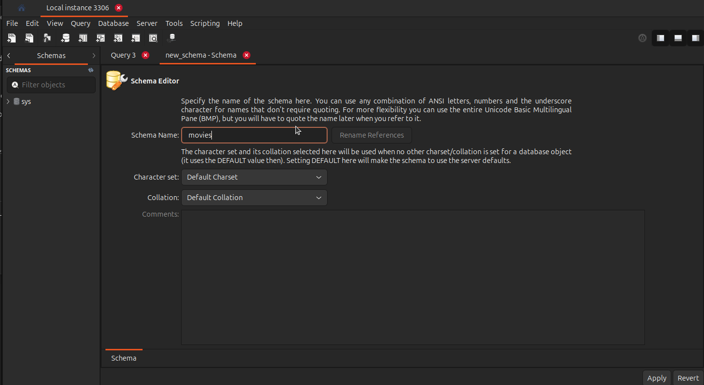

+++
title = "Introduction to Databases"
type = "chapter"
weight = 141
+++

## Competency and Learning Objectives

### Competency:

Introduction to Databases

### Learning Objectives:

- I can explain the role of databases in full stack web development.
- I can create a database in MySQL Workbench.

## Introduction

Databases are persistent storage systems that allow us to store and retrieve information.  Databases are essential to
most web applications as they allow us to store data that will live beyond the life of a single request and even to live
between restarts of the application or the computer/server that the application is running on.

## The Role of Databases

A full stack web application stack, consists of:

- **Front End**: The part of the application that the user interacts with.  This is typically a web page or a mobile
    app.
- **Back End**: The part of the application that runs on the server.  This is typically a web server that handles
    requests from the front end and returns responses.
- **Database**: The part of the application that stores data.  This is typically a database server that stores data
    in a structured and indexed format.

The database is the bottom layer of the stack and is responsible for permanently and securely storing data that the
backend application needs to provide to the front end.

If you think about a web application like facebook, the front end is the web page that you see when you visit 
facebook.com, the back end is the server that handles requests from the front end and returns responses, and the
database stores all user data, posts, comments, and other information that the application needs to function.

For this lesson, we will be using MySQL and MySQL Workbench to create and manage our databases.

### Database First vs. Code first

There are two main approaches to working with databases in web applications:

- **Database First**: This approach involves creating the database first and then generating the code to interact with
    the database.  This approach requires learning a new language, SQL, and using a tool like MySQL Workbench to
    create and manage the database.
- **Code First**: This approach involves writing java classes in our backend code and annotating them with
    information about how they should be stored in the database.  This approach relies on the framework to generate the
    appropriate SQL to create and manage the database.

For now, we will be focusing on the Code First approach.  This approach is more common in modern web applications
and is the approach used by most frameworks.  This approach also has the benefit of building on the knowledge you have
gained in previous courses about object-oriented programming and Java without requiring you to learn a new language.

With a code first approach, we will still be using MySQL Workbench to create our initial empty database, and then
occasionally to inspect the database to ensure data is being stored correctly, so it is still important to understand
the basics of how to use MySQL Workbench, and we will be reviewing that in this lesson and in coming lessons as it
comes up.

> [!NOTE]
> Later we will learn about SQL and how to use it to interact with databases.  SQL is a powerful
> language that allows us to perform complex queries and operations on the database.  Learning SQL will be essential
> if you want to work with databases in a professional setting or if you want to build more complex web applications.

### Check For Understanding

1. **Question:** What are the three main components of a full stack web application?
    - **Answer:** Database, Backend, Frontend
2. **Question:** What are the two main approaches to working with databases in web applications?
    - **Answer:** Database First, Code First
3. **Question:** What is the role of a database in a full stack web application?
    - **Answer:** To store data that the backend application needs to provide to the front end.
4. **Question:** What is the role of MySQL Workbench in this course?
    - **Answer:** To create and manage our databases.

## Creating a Database

To create a database in MySQL Workbench, follow these steps:

1. Open MySQL Workbench and connect to your MySQL server by clicking on the "Local instance 3306" button. The local
    instance is the default MySQL server that is installed on the computer where MySQL Workbench is running. In this
    case, your computer.

2. Click on the "Create a new schema in the connected server" button.

3. Enter a name for your database in the "Name" field and click "Apply".

4. Click "Finish" to create the database. You should see your new database in the "SCHEMAS" tab on the left side of the
    screen.

At this point, you have created an empty database.  We will not be creating tables in this database yet, as we will be
using the code first approach to generate the tables for us later in the course when we start working with Spring Boot.
However, it is important to understand how to create a database and how to connect to it using MySQL Workbench as we
will need this knowledge later in the course!

### Check For Understanding

1. **Question:** What is the first step to create a database in MySQL Workbench?
    - **Answer:** Open MySQL Workbench and connect to your MySQL server.
2. **Question:** What does "local instance 3306" mean?
    - **Answer:** It is the default MySQL server that is installed on the same computer that MySQL Workbench is running
      on.

## Reflection Task

- Prompt: Reflect on the role of databases in full stack web development.  Think of your favorite web application and
    how it likely uses a database to store data.  Write a short paragraph about what data you think is stored in the
    database and how it is used by the application.
- Expected Outcomes: 
    - **Green**: The student has a clear understanding of the role of databases in full stack web development and can
        articulate how a specific web application likely uses a database to store data.
    - **Yellow**: The student has some understanding of the role of databases in full stack web development but fails
        to correctly identify what kinds of data are likely stored in their example application's database.
    - **Red**: The student has little to no understanding of the role of databases in full stack web development and is
        unable to articulate how a specific web application likely uses a database to store data.

## Conclusion

In this lesson, we have learned about the role of databases in full stack web development and how to create a database
in MySQL Workbench.  We have also learned about the two main approaches to working with databases in web applications:
Database First and Code First.

The ideas and skills we have learned in this lesson will be essential as we continue to build our full stack web
applications using Spring Boot and MySQL.

