+++
title = "Git Branching and Merging"
type = "chapter"
weight = 5
+++

## Competency and Learning Objectives

### Competency:

Git Branching and Merging

### Learning Objectives:

- I can create a feature branch from main and move between branches.
- I can use the git diff command to compare the code in two branches line by line
- I can merge a feature branch into main on my local machine.
- I can open a pull request into main on GitHub and merge that feature branch, closing the PR.
- I can update my local main branch with the merged code from the remote repository.
- I can engage in branching, committing, and merging best practices

## Introduction

Throughout the early chapters of this program, you learned the basics of using `git` to get
starter code from remote repositories, and to commit and push changes to your own copies of
those repositories on GitHub. 

Your view of a Git repository so far has been a linear history of commits, but Git is actually a
powerful tool for managing multiple lines of development at the same time.  This is done through
the use of branches, which allow you to create separate lines of development that can diverge
from the main line of history and later be merged back into the main branch or other branches.

In this chapter, we will explore how to use the `git` tools that we have learned to create and
manage branches, merge changes, and resolve conflicts. We will also learn how to push these
different branches to a remote repository on GitHub.

## What is a Branch?

A branch in "Git" has a somewhat confusing name.  A branch is in short just a bookmark to a
specific commit in the history of a repository.  By default, every Git repository has a
single branch called `main` (or `master` in some older repositories).  When you make a
new commit, the commit is appended to the end of the chain of commits and the `main` branch
is updated to point to that new commit.

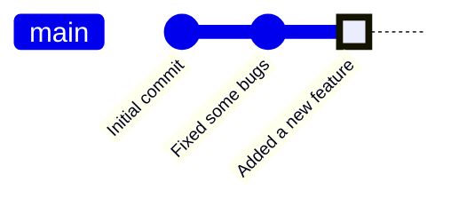

This is a diagram of the workflow that you've been using so far.  Each commit is a point in
the history of the repository, and the `main` branch points to the last commit in that history
(the "Added a new feature" commit in this case).

On a simple project, this linear history is fine, but for a larger project, we often want to
keep the code on the `main` branch stable while we work on new features in a separate copy
where we won't accidentally break the code that is already in production.  This is where
branches come in handy.  A branch let's us start from the current point of the `main` branch
and create a new line of development that can diverge from the `main` branch, while keeping
the `main` branch intact, and letting is switch back to it at any time.

Let's create a new branch.  For learning, you may want to copy one of your existing project folders
that has been commited to Git and start working in that copy.  You can copy the folder using
the command line or your file explorer (You do not need to do anything special to copy a Git
repository, just copy the folder as you would any other folder).

Once you load the project in VS Code, click on the "Source Control" icon in the left sidebar
to open the Source Control pane.  This should be familiar to you from previous chapters.

Right now, your project has only one branch, `main`, which is the default branch that
Git creates when you initialize a new repository.  To create a new branch, click the "..." menu
in the Source Control pane, and then select "Branch" and then "Create Branch...".

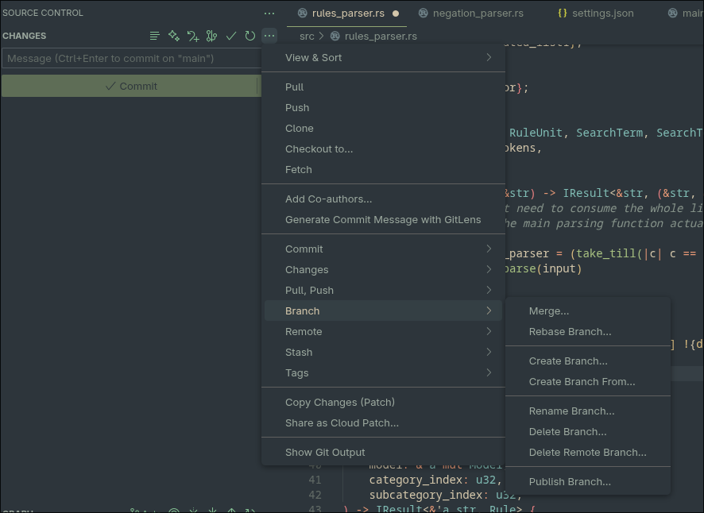

Enter a name for your new branch, such as `feature-branch`, and press Enter.  This will create
a new branch that points to the same commit as the `main` branch.  If you look at the graph pane
below the "Changes" section, you will see that it is now showing `feature-branch` instead of `main`.
This is because when we create a new branch, Git automatically switches us to that branch.

You can switch back to `main` by clicking the "..." menu again, selecting "Checkout To..", and then
selecting `main`.  This will switch you back to the `main` branch, and the graph will update to
show the `main` branch again.  Practice switching between these two branches a few times and notice
that the graph updates to show the current branch you are on, but that for right now, both branches
have the same commit history (They are both "pointing" to the same commit).

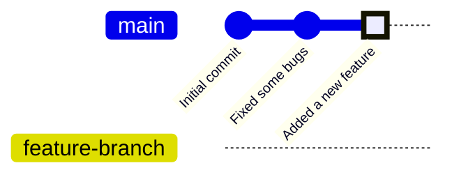

Where branches get interesting is when you start making changes on the new branch.  When you
make a new commit on the `feature-branch`, the `feature-branch` bookmark moves forward to point
to the new commit, while the `main` branch remains unchanged.

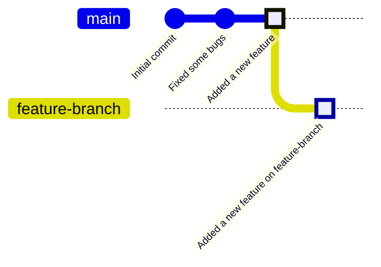

Now, the `feature-branch` points to a new commit that is not part of the `main` branch's history.
We have made a new commit, but by making the commit while we were on the `feature-branch`, we are
saying that this commit is part of the `feature-branch` line of development, not the `main` line.

The `main` branch can continue to receive new commits while you work on the `feature-branch`.
At this point, you can see that there is a divergence in the history of the two branches:

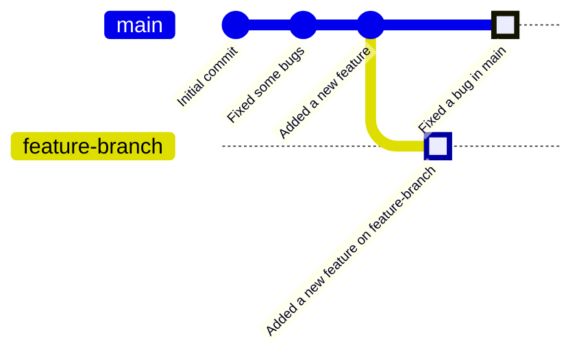

After a few more commits on both branches, the history of the two branches might look like this:

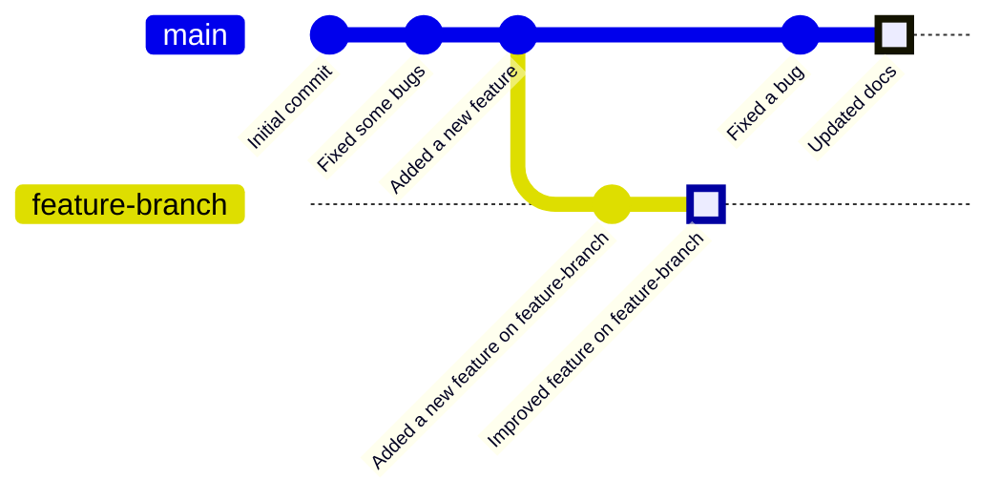

We can create more branches in the same way.  Before we do so, however, it's important to make sure
that we are on the branch we want to create the new branch from.  If we are on `main`, then the new
branch will be created from the latest commit on `main`.  If we are on `feature branch`, then the new
branch will be created from the latest commit on `feature-branch`.

In the example above, here's what it would look like if we created a new branch called `feature-branch-2`
from the `feature-branch`:

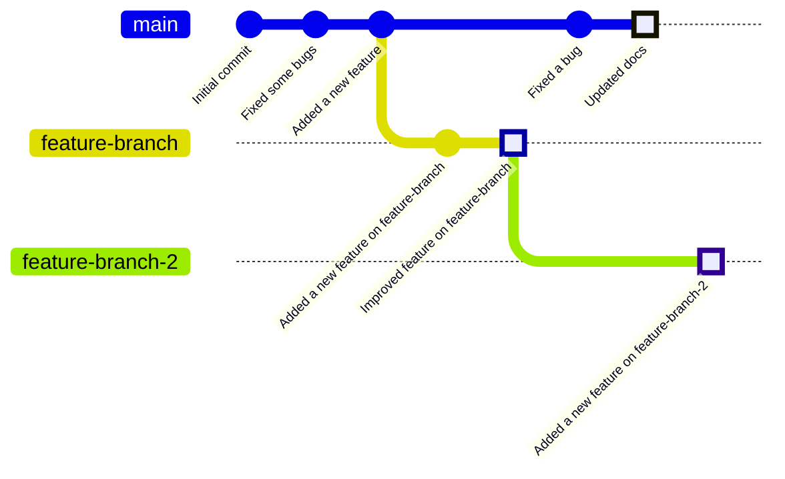

And here's what it would look like if we created a new branch called `feature-branch-2` from
the `main` branch instead:

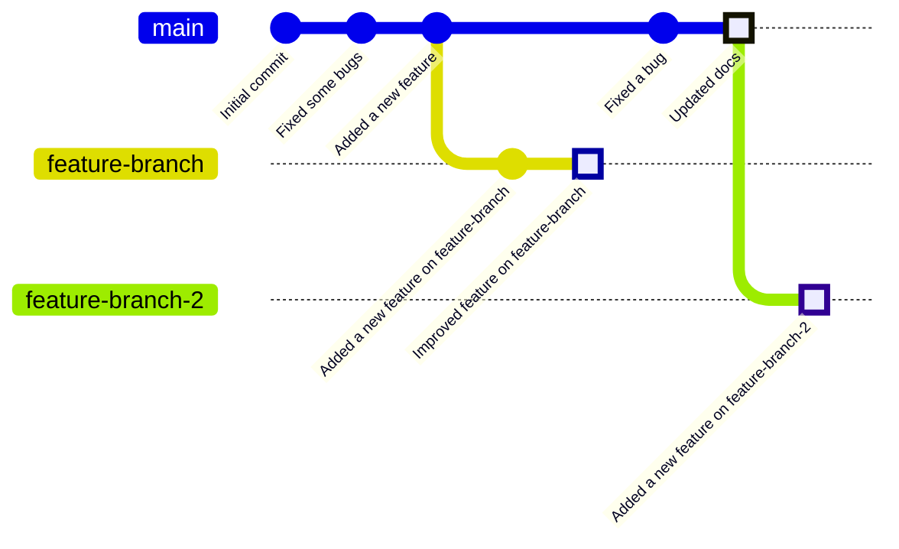

Typically, this is what we want - to create all of our feature branches from the `main` branch.  Branching
off of a branch is typically a messy and confusing workflow, and is best avoided unless you have a specific reason
for doing so.

## Merging

At some point, we will complete the feature that we were working on in our `feature-branch`, and we will want to
merge those changes back into the `main` branch where everyone can see them in the main line of development and
they can be included in the next release of the software.

We can rejoin the feature branch to main by **merging** the feature branch into main.  To do this, we first need to
switch back to the `main` branch.  A merge operation is always done from the *desination* branch, which is the branch
that we want to merge changes *into*.  In this case, we want to merge changes into `main`, so we need to be on `main`
when we do the merge.

> [!NOTE]
> In Visual Studio Code, you can switch branches by clicking on the three dots in the Source Control pane,
> selecting "Checkout To...", and then selecting the branch you want to switch to.

To merge the `feature-branch` into `main`, we can click the "..." menu in the Source Control pane,
select "Branch", and then select "Merge Branch...".  This will open a dialog where you can select the branch
you want to merge into the current branch.

Once the merge is complete, you will see that the `main` branch now contains all of the changes from the
`feature-branch`.

The graph of the repository will now look like this:

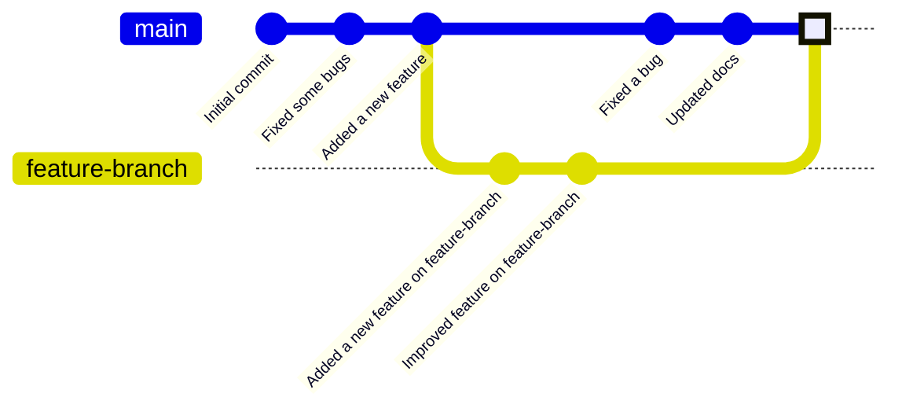

### Merge Conflicts

Usually, when we merge a branch into another branch, Git is able to automatically combine the changes
from both branches.  However, if the same lines of code were changed in both branches, Git will not know
which change to keep and will raise a **merge conflict**.  A merge conflict requires manual resolution
before the merge can be completed.

If a merge conflict occurs, you will see a message in the Source Control pane indicating that there
are merge conflicts that need to be resolved. 

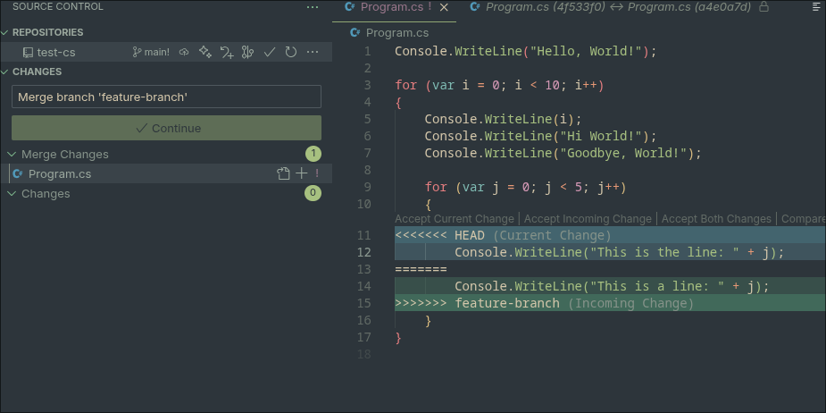

To resolve a merge conflict, you will need to open the files that have conflicts and resolve the conflicts.
This may sound intimidating, but Visual Studio Code provides a user-friendly interface to help you
resolve merge conflicts.

Each conflict in the file will be marked with special markers that indicate the conflicting changes with
a blue region and a green region showing each version of the lines (blue is the current branch, green is the
branch being merged in).  There are links above the conflicting lines that allow you to choose which
version of the lines to keep.

Once you have resolved all of the conflicts in the file, you will need to stage the changes and commit
the merge.  You can do this by clicking the "..." menu in the Source Control pane and selecting "Stage All Changes",
then entering a commit message and clicking the checkmark icon to commit the merge.

> [!NOTE]
> When you resolve a merge conflict, you have to add and commit the changes to complete the merge.
> This is because the merge operation itself involves a set of changes that need to be tracked as
> a new commit in the history of the repository.

Once you have resolved all of the merge conflicts and committed the changes, the merge is complete
and the `main` branch now contains all of the changes from the `feature-branch`.

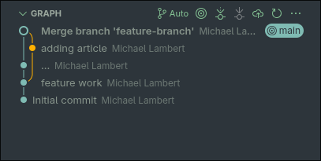

## Branching and Merging in the Real World

So now that you know how to create branches and merge them, how does this typically work in the
real world?

In a typical project, the `main` branch is kept stable and only contains code that is ready for production.
When a developer wants to work on a new feature or bug fix, they create a new branch from `main`
and work on that branch until the feature is complete.  Once the feature is complete, they
merge the feature branch back into `main`.

Sometimes, instead of doing this merge themselves, the developer asks another developer to
look at their branch, review the code, and then merge it into `main`.  This request is called a
**pull request** and involves using tools provided by GitHub to facilitate the code review and
merging process.  We will learn more about pull requests in the next chapter.

When a version of the software is ready to be released, a special branch called a **release branch** is
created from `main`.  This branch is used to prepare the code for release, including final testing,
bug fixes, and documentation updates.  Once the release is ready, the release branch is merged back
into `main` and tagged with a version number.

## Practice/Project Task

- Activity Description: GitHub Project
- Prompt: Fork the [Git Branching](https://github.com/LaunchCodeEducation/software-dev-course-git-branching)
project from github into your own account, clone it to your local machine, and complete the
exercises as describe in the README.md file.  When you are finished, push your changes to your
forked repository.request
- Format (individual, pair programming, presentation, group discussion, etc.): Individual
- Tools:  Git, GitHub, JetBrains IntelliJ IDEA
- Time Estimate: 1 hour
- Expected Outcomes: 
    - **Green**: All exercises are completed and the git commit history shows branching and merging
    - **Yellow**: Some branching is completed, but the merge is not done or the commit history does not
    reflect the branching and merging process described in the README.md file.
    - **Red**: The repository history does not include branching and merging.

## Summary

In this chapter, we learned about branches in Git and how they allow us to create separate lines
of development.  We learned how to create branches, switch between branches, and merge branches
together resolving any conflicts that occur while doing so.

We also discussed how branching and merging are used in real-world projects to manage development
and releases.  In the next chapter, we will learn about using branching and merging with additional
tools provided by GitHub to collaborate with other developers on a project.
