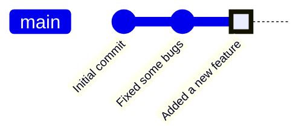
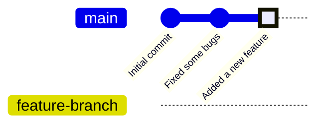
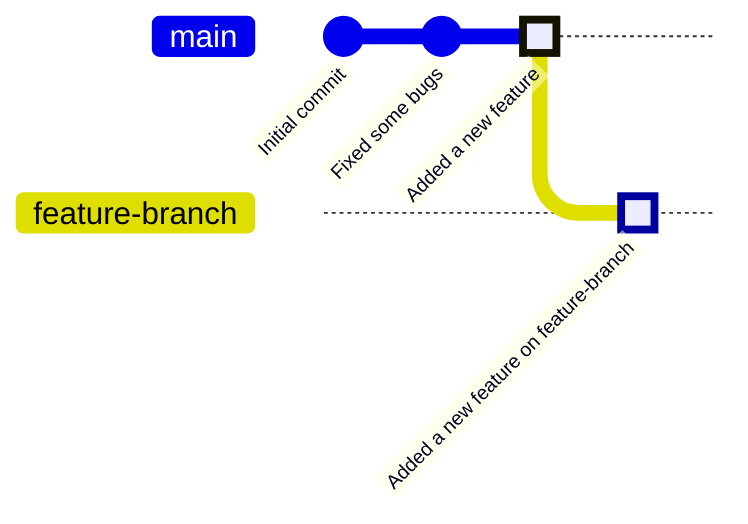
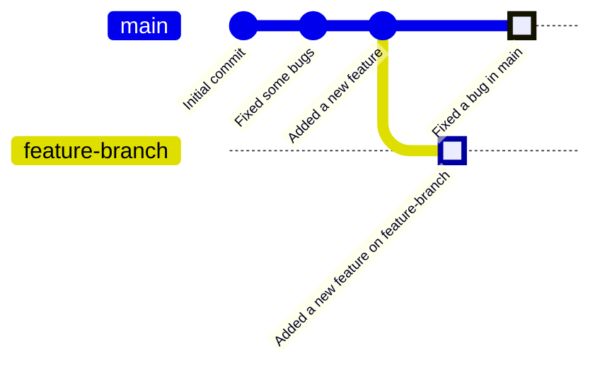
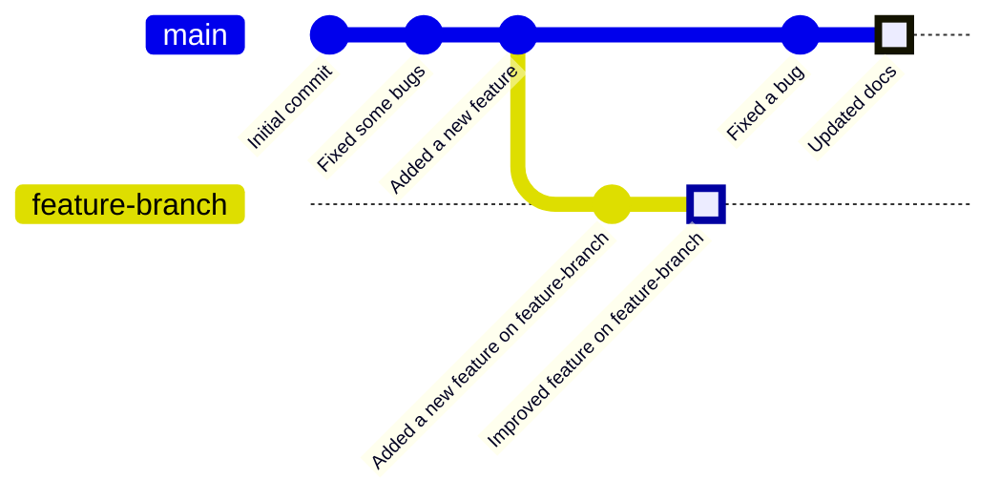

+++
title = "Git Branching and Merging"
type = "chapter"
weight = 5
+++

## Competency and Learning Objectives

### Competency:

Git Branching and Merging

### Learning Objectives:

- I can create a feature branch from main and move between branches.
- I can use the git diff command to compare the code in two branches line by line
- I can merge a feature branch into main on my local machine.
- I can open a pull request into main on GitHub and merge that feature branch, closing the PR.
- I can update my local main branch with the merged code from the remote repository.
- I can engage in branching, committing, and merging best practices

## Introduction

Throughout the early chapters of this program, you learned the basics of using `git` to get
starter code from remote repositories, and to commit and push changes to your own copies of
those repositories on GitHub. 

Your view of a Git repository so far has been a linear history of commits, but Git is actually a
powerful tool for managing multiple lines of development at the same time.  This is done through
the use of branches, which allow you to create separate lines of development that can diverge
from the main line of history and later be merged back into the main branch or other branches.

In this chapter, we will explore how to use the `git` tools that we have learned to create and
manage branches, merge changes, and resolve conflicts. We will also learn how to push these
different branches to a remote repository on GitHub.

## What is a Branch?

A branch in "Git" has a somewhat confusing name.  A branch is in short just a bookmark to a
specific commit in the history of a repository.  By default, every Git repository has a
single branch called `main` (or `master` in some older repositories).  When you make a
new commit, the commit is appended to the end of the chain of commits and the `main` branch
is updated to point to that new commit.

This is a diagram of the workflow that you've been using so far.  Each commit is a point in
the history of the repository, and the `main` branch points to the last commit in that history
(the "Added a new feature" commit in this case).

Let's create a branch.  For learning, you may want to copy one of your existing project folders
that has been commited to Git and start working in that copy.  You can copy the folder using
the command line or your file explorer (You do not need to do anything special to copy a Git
repository, just copy the folder as you would any other folder).

Once you load the project in VS Code, click on the "Source Control" icon in the left sidebar
to open the Source Control pane.  This should be familiar to you from previous chapters.

Right now, your project has only one branch, `main`, which is the default branch that
Git creates when you initialize a new repository.  To create a new branch, click the "..." menu
in the Source Control pane, and then select "Branch" and then "Create Branch...".

Enter a name for your new branch, such as `feature-branch`, and press Enter.  This will create
a new branch that points to the same commit as the `main` branch.  If you look at the graph pane
below the "Changes" section, you will see that it is now showing `feature-branch` instead of `main`.
This is because when we create a new branch, Git automatically switches us to that branch.

You can switch back to `main` by clicking the "..." menu again, selecting "Checkout To..", and then
selecting `main`.  This will switch you back to the `main` branch, and the graph will update to
show the `main` branch again.  Practice switching between these two branches a few times and notice
that the graph updates to show the current branch you are on, but that for right now, both branches
have the same commit history (They are both "pointing" to the same commit).

Where branches get interesting is when you start making changes on the new branch.  When you
make a new commit on the `feature-branch`, the `feature-branch` bookmark moves forward to point
to the new commit, while the `main` branch remains unchanged.

Now, the `feature-branch` points to a new commit that is not part of the `main` branch's history.
We have made a new commit, but by making the commit while we were on the `feature-branch`, we are
saying that this commit is part of the `feature-branch` line of development, not the `main` line.

The `main` branch can continue to receive new commits while you work on the `feature-branch`.
At this point, you can see that there is a divergence in the history of the two branches:

After a few more commits on both branches, the history of the two branches might look like this:

