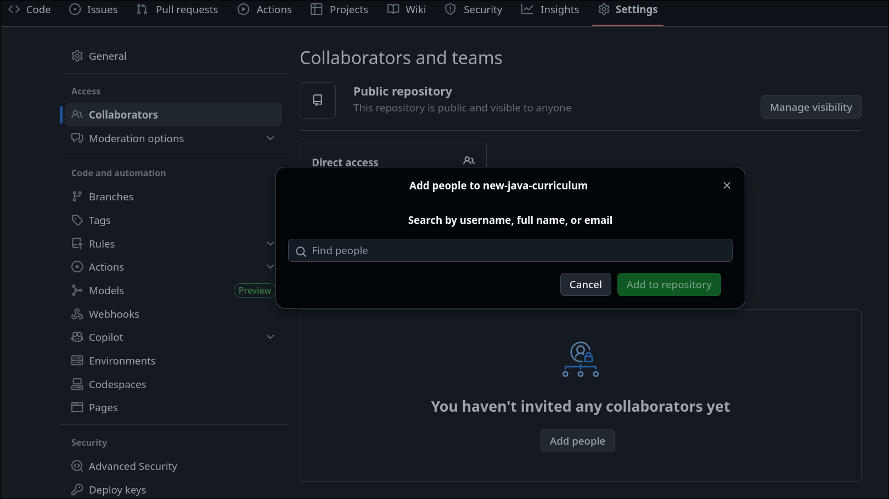
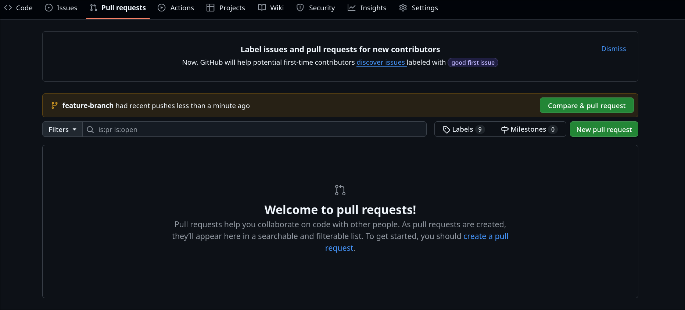
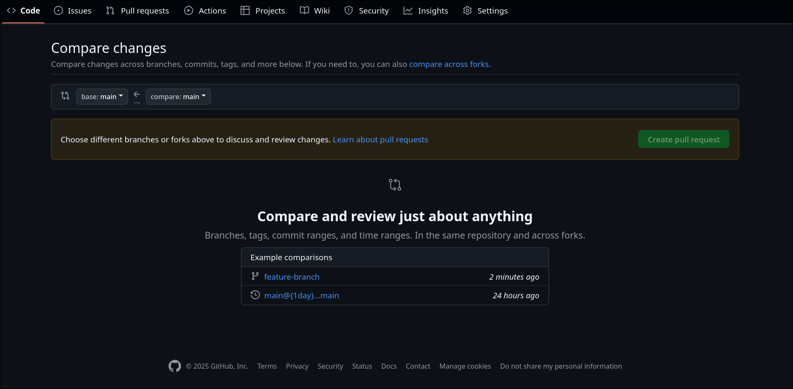
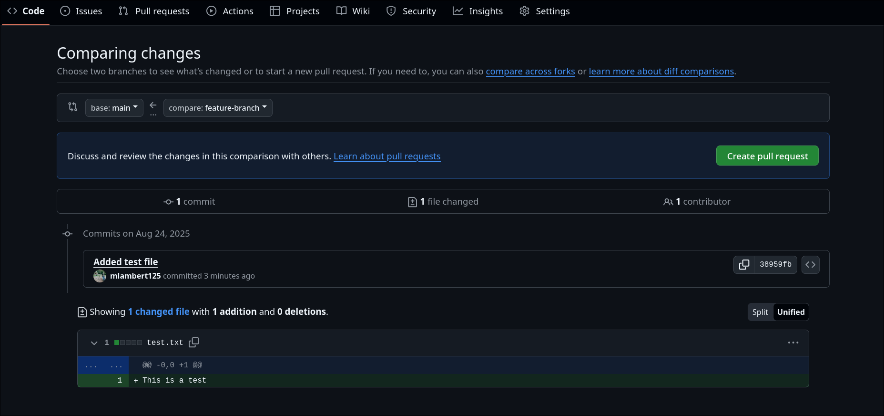
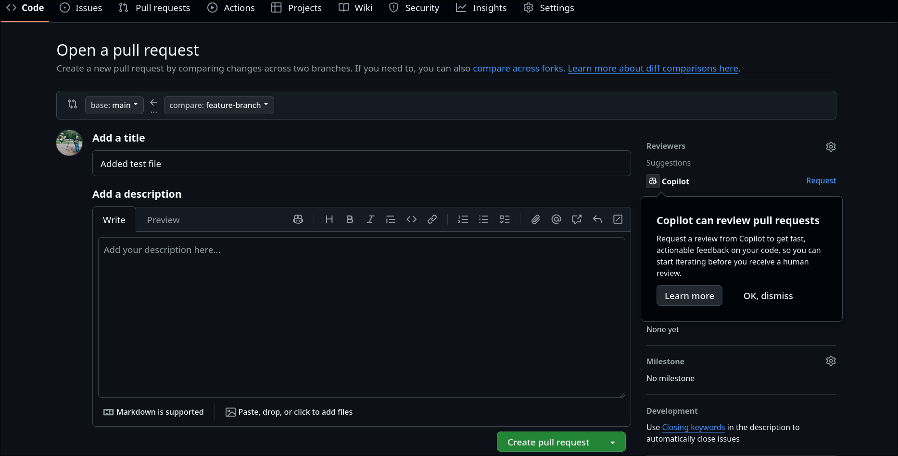
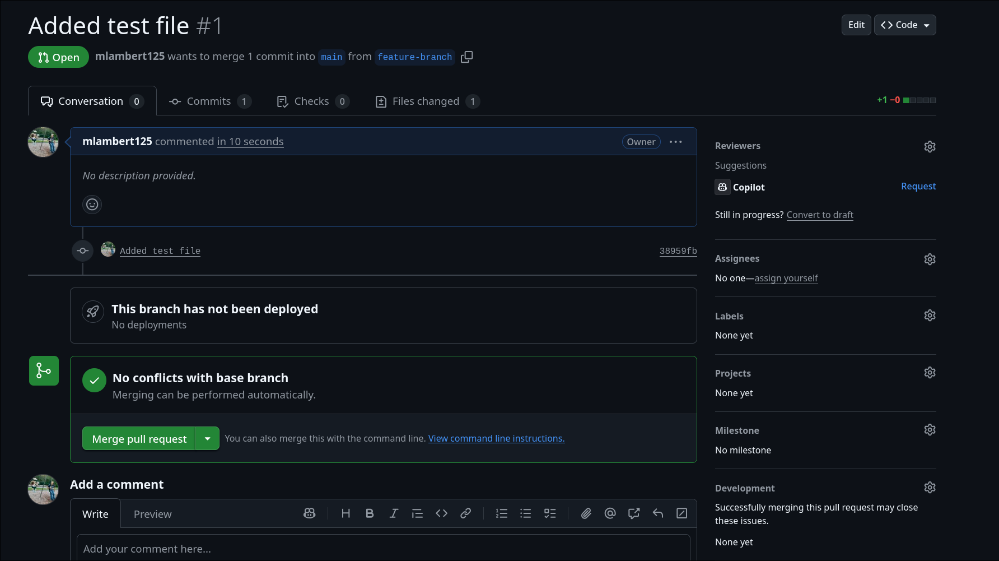

+++
title = "Git Collaboration"
type = "chapter"
weight = 6
+++

## Competency and Learning Objectives

### Competency:

Git Collaboration

### Learning Objectives:

- I can explain best practices in Git workflow, including engaging in a consistent workflow practice,
preventing merge conflicts, and performing code reviews.
- I can add collaborators to a single GitHub repository.
- I can open a pull request into main on GitHub and merge that feature branch, closing the PR.
- I can assign, review, respond, and approve reviews on a collaborator’s PR at specific lines of code.

## Introduction

At this point in the course, you have learned the basics of using `git` to get starter code from 
remote repositories, and to commit and push changes to your own copies of those repositories on
GitHub.  You have also learned to understand git branching and the branching graph nature of a Git
repository.

Git is useful as an individual, but it's real power comes when you use it to collaborate with
others.  Git allows multiple people to work on the same codebase at the same time and offers
powerful tools to manage changes, resolve conflicts, and review code.  GitHub, as a hosting
platform for Git repositories, enhances this collaboration by providing a user-friendly interface,
issue tracking, and pull requests for code reviews.

In this chapter, we will explore how to use the `git` tools that we have learned and the GitHub
repository hosting platform to build collaborative software projects.

## Assigning Collaborators to a Repository

To collaborate on a project using Git and GitHub, you first need to add collaborators to your
repository on GitHub. This allows others to contribute to your project by pushing changes
directly to the repository or by creating pull requests.

To add collaborators to your GitHub repository, follow these steps:

1. Navigate to your repository on GitHub.
2. Click on the "Settings" tab.
3. In the left sidebar, click on "Collaborators".
4. Click the "Add people" button at the bottom of the page.
5. Select the user from the dropdown list and click "Add collaborator".
6. The user will receive an email invitation to collaborate on the repository. They need to accept
   the invitation to gain access.
7. Once added, collaborators can clone the repository, create branches, make changes, and push
    their changes.



Remember to communicate with your collaborators about the workflow and guidelines for contributing
to the project to ensure a smooth collaboration process.

## Feature Branch Workflow

A common workflow for collaborating on a Git project is the feature branch workflow. In this
workflow, each collaborator creates a separate branch for each feature or bug fix they are
working on. This allows multiple people to work on different features simultaneously without
interfering with each other's work.

Here are the steps for using the feature branch workflow, presuming a collaborator named
Alice has been assigned to work on a feature for Bob's repository and wants to contribute
her changes to the main repository to have Bob review and merge them:

1. **Clone the Repository**: Alice clones the main repository to her local machine if she hasn't
   already done so using the tools in her editor/IDE or the command line:
   ```bash
   git clone https://github.com/bobs-software-inc/our-cool-project.git
   ```

2. **Create a New Branch**: Alice creates a new branch for her feature using the tools in her
   editor/IDE or the command line:
   ```bash
   git checkout -b user-management-feature
   ```

3. **Make Changes**: Alice makes changes to the codebase on her new branch. She can add new files,
   modify existing files, and delete files as needed. 

4. **Stage and Commit Changes**:
   When alice is ready to save her changes, she stages and commits them using the tools in her
   editor/IDE or the command line:
    ```bash
    git add -A 
    git commit -m "Add user management feature"
    ```

5. **Push the Branch to GitHub**: Alice pushes her feature branch to the remote repository on
    GitHub using the tools in her editor/IDE or the command line:
    ```bash
    git push origin user-management-feature
    ```

6. **Open a Pull Request**: Alice opens a pull request on GitHub to merge her feature branch into
    the main branch. She can do this by navigating to the repository on GitHub, clicking
    the "Pull requests" tab, and then clicking the "New pull request" button. She selects her
    feature branch as the source and the main branch as the target, adds a description of her
    changes, and submits the pull request.

7. **Code Review**: Bob reviews Alice's pull request, providing feedback and requesting changes if
    necessary. Alice can respond to comments and make additional commits to her feature branch
    as needed.

8. **Merge the Pull Request**: Once Bob is satisfied with the changes, he merges Alice's pull
    request into the main branch using the "Merge pull request" button on GitHub.

9. **Delete the Feature Branch**: After the pull request is merged, Alice can delete her feature
    branch both locally and on GitHub to keep the repository clean. She can do this using
    the tools in her editor/IDE or the command line:
    ```bash
    git branch -d user-management-feature
    git push origin --delete user-management-feature
    ```
10. **Update Local Main Branch**: Bob and Alice should update their local main branches to
    reflect the latest changes from the remote repository. They can do this using the tools in
    their editor/IDE or the command line:
    ```bash
    git checkout main
    git pull origin main
    ```

By following these steps, Alice and Bob can effectively collaborate on the project using the
feature branch workflow. This workflow helps to keep the main branch stable and allows for
easy code reviews and integration of new features.

You already know how to do most of these steps from previous chapters, but let's take a closer look
at the steps involved in creating and reviewing a pull request on GitHub.

## Creating a Pull Request

A pull request (PR) is a way to propose changes to a codebase and request that those changes be
reviewed and merged into the main branch. Pull requests are a key feature of GitHub and
facilitate collaboration and code review.

To create a pull request on GitHub, follow these steps:

1. Navigate to the repository on GitHub where you want to create the pull request.
2. Click on the "Pull requests" tab.
3. Click the "New pull request" button.

4. Select the branch you want to merge into the main branch (the base branch) and the branch
   containing your changes (the compare branch).

5. Click the branch that you want to merge from at the bottom of the page. 

6. Click the "Create pull request" button.

7. Add a title and description for your pull request, explaining the changes you made and why
   they are important.
8. Choose reviewers on the right side of the page if you want specific people to review your changes.
    (In Alice's case, she would choose Bob as a reviewer.)
8. Click the "Create pull request" button to submit your pull request.

## Reviewing a Pull Request

Once a pull request is created, collaborators can review the changes and provide feedback. To
review a pull request on GitHub, follow these steps:

1. Navigate to the repository on GitHub and click on the "Pull requests" tab.
2. Click on the pull request you want to review.
3. Review the changes made in the pull request by looking at the "Files changed" tab.
4. Leave comments on specific lines of code by clicking the "+" icon next to the line number.
5. If you have suggestions for changes, you can leave comments in the pull request discussion
   thread.
6. Once you are satisfied with the changes, you can approve the pull request by clicking the
   "Review changes" button and selecting "Approve".



## Conclusion

In this chapter, we have explored how to use Git and GitHub for collaboration on software projects.
We have learned how to add collaborators to a repository, use the feature branch workflow, create
pull requests, and review code changes. By following these best practices, you can effectively
collaborate with others and contribute to shared codebases using Git and GitHub.
