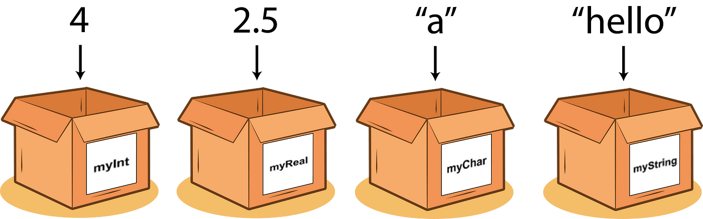
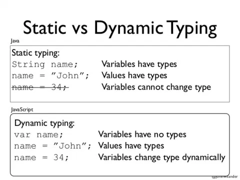
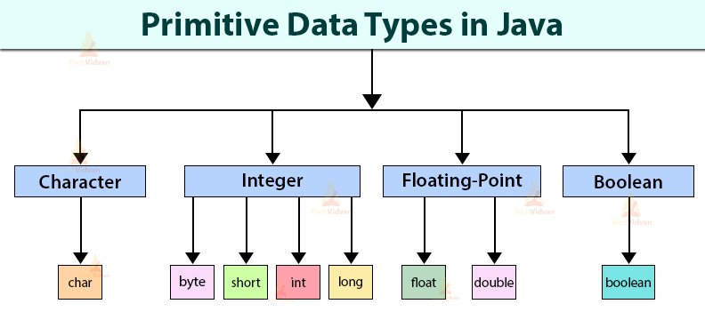
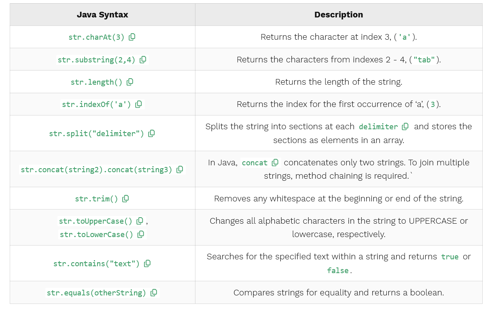
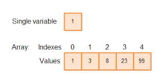

+++
title = "Java Basics 1"
type = "chapter"
weight = 30
+++

## Competency and Learning Objectives

### Competency:

Java Basics

### Learning Objectives:

- I can recognize Java data types and when to utilize the proper ones for a given situation.
- I can manipulate Strings and arrays.

## Introduction

Computer programs are, at their core, concerned with storing, moving and operating on *values*.  For example, the
number 8 is a value, as is the name “Joe Smith”, or the color Purple.

Every value used in a program has a **type**.  For example, the number **2** typically would have a type of **int**
(i.e. a number without a decimal part), where the message **“Hello World”** would have a type of **String**.  The types
of these values specify the set of allowed values, how the value is stored in memory, and primarily what operations are
allowed on the value.  

For example, we can divide two **Integers** (5 / 3 makes sense), but we could not divide two **Strings** (“Hello” /
“World” doesn’t make any sense.), nor could we divide an **Integer** by a **String**. (“Hello” / 3 also doesn’t make
much sense.)

One way that programming languages differ is in how they deal with differences in the types of values when it comes to
storing and operating on them.

For example, if we want to store a value in memory to use it later, we typically store it in a kind of “box” called a
**variable**.



In some languages (like JavaScript), when we create a variable, we simply give it a name and can store any type of value
in that variable.  In Java, however, we declare a variable with both a name **and** a type.  The type of the variable
constrains the variable to only hold values of that type.

A language like javascript that ***does not*** constrain the type of value held by each variable is called a
**dynamically-typed** language.  The main advantage of a dynamically-typed  language is that a programmer does not need
to think about types at every point in the program’s design, and can easily write variables and functions that can
handle many different types of values without a lot of extra code.  The main disadvantage is that unexpected types can
be stored in variables or passed to functions, and if the programmer did not account for these types, the problem will
not be apparent by a person or software analyzing the code before running it - instead, the problem may only be found
later when the program actually encounters an unexpected value. 

A language like java that ***does*** constrain the type of value held by the variable is called a **statically-typed**
language.  The main advantage of a statically-typed language is that all variables, parameters and function return types
explicitly define their expected types and passing an invalid type to a function can be detected and prevented without
even running the program.  Another advantage is that the code can be run more quickly and efficiently because many
optimizations can be made by the computer when it knows this information ahead of time.  The disadvantage is that
writing programs in a statically typed language requires more coding, and more design and foresight to account for the
types of all variables, parameters, return types, etc.



Java is a **statically typed** language.  To write software in java, we need to understand the available types and how to specify and use those types, and even how to define new types.  This information is called java’s **type system**.

Java’s type system includes two different kinds of types:

1. **Primitive Data Types** - These are very small data types that java knows how to store and operate on very
   efficiently. You can not create your own primitive types.
2. **Object Data Types** - These are more complex data types that often vary in size and require more complex storage
   and handling.  You can create your own object data types in java that are a composite of primitive data types or
   other object data types and provide their own operations (methods.)

## Primitive Data Types
There are eight primitive types in java: **byte**, **short**, **int**, **long**, **float**, **double**, **char**, and
**boolean**.  Six of these types are for storing different types of numbers, and the last two are for storing
alphanumeric characters, and true/false variables respectively.

| Type            | Description |
|-----------------|-------------|
| byte            | Stores a very small whole number between -127 and 128 |
| short           | Stores a small whole number between -32,768 and 32,767 |
| int             | Stores a medium whole number between -2,147,483,648 and 2,147,483,647 |
| long            | Stores a large whole number between -9,223,372,036,854,775,808 and -9,223,372,036,854,775,808 |
| float           | Stores a medium precision decimal number |
| double          | Stores a large precision decimal number |
| char            | Stores a single alpha-numeric character. |
| boolean         | Stores one of the two values: true or false |

>[!NOTE] Casing
Primitive data types in Java are all lowercase.



### Check For Understanding

1. **Question:** What is an int in Java? 
    - **Answer:** A data type representing whole numbers / A data type representing text / A data type representing decimal
2. **Question:** True or false: A boolean value is a primitive value
    - **Answer:** True

## Object Data Types

Primitive data types can be combined to build larger object data types. Some object data types are provided by java
natively, and some are defined by you, the developer, as appropriate to the problem at hand.  Object data types include
both state, and a set of methods that can be called to act on the object data.

>[!NOTE] Syntax Fact
>Object data types in Java begin with a Capital letter and use “Pascal Casing” where each word in the name also starts
>with a Capital Letter (e.g. WebUser) 

### The String Data Type:

In Java, a **String** is an object that represents a sequence of characters. Strings in Java are immutable, meaning that
the individual characters within a string cannot be changed. Java provides a robust API for manipulating strings,
allowing us various method operations such as concatenation, comparison, and others.

There are two ways to create a **String**: String Literal with double quotation marks, and utilizing the `new` keyword.
Normally, Object data types are created with the `new` keyword, however, String is an especially common type in java, so
java offers some extra options for creating and referring to strings.

```java
//String Literal
String staticVariable = "dog";
String myString = "Hello, World!";

//Using new keyword
String s = new String("Welcome!")
```

Once a string has been created, methods belonging to the string type can be called to act on the string.  The table below summarizes some of the most common string methods available in Java. For these examples, we use the string variable

```java
String str = "Rutabega"
```



### Arrays

Arrays in Java are another special object type in java that offer some additional syntax support.  Arrays work a bit
differently than they do in some other languages. In Java, an array is a fixed-sized collection of elements of the same
type referred to by a common name. We can create an array of integers or an array of strings, but we can NOT create an
array that holds both integers AND strings.  Some important things to remember about the way arrays work are:

- Arrays are objects in Java. 
- Arrays hold multiple values of the same type.
- The values in arrays are ordered by indices starting at 0, and ending at the length of the array -1 (e.g. an array of
length 3 has indices 0, 1, and 2.)
- The size of an array must be specified by an int value.
- The length of an array is fixed once declared. (You can not add or remove items.)



#### Declaring an Array

```java
// Declaring an array of integers
int[] arrayName;
```

>[!NOTE] Uninitialized Array 
>This array is not initialized, it is simply demonstrating the proper Java syntax for declaring the Array type.

#### Creating an Array
To create an array, you allocate memory for it by using the new keyword

```java
// Creating an array capable of holding 10 integers
numbers = new int[10]
```

This statement initializes the numbers array to hold 10 integers. Remember, the number of integers this array can hold
cannot be changed after it is initialized. 

Beforehand, you can create this number to be whatever you choose, just as you can choose any type of array. The default value for each element in the **array** is **0**.

We can also initialize an array using a literal expression:

```java
int[] literalNumbers = { 1, 2, 3, 4, 5 , 6, 7, 8, 9, 0 }
```

Here, the size of the array is implied by the literal number of elements in the expression. Note the use of curly brackets instead of square brackets.

#### Accessing An Element of An Array

To access array elements, we use square brackets and the element indices - which start from zero, if you recall.

```java
// Setting the first element of the numbers array
literalNumbers[0] = 7;

// Accessing the first element of the numbers array
int firstElement = literalNumbers[0];
```

The first line sets the value of the first array element to 7, and the second line retrieves the value of the first
array element.

#### Change an Array element

To change an element, assign a new value to a specific index in the array.

```java
//Change the first element in the numbers array
literalNumbers[0] = 12;
```

#### Array Length
We can determine the length of an array using the length property.

```java
//Getting the length of an array
int length = numbers.length
```
### Java Objects Review
- In Java, **objects** are structures that have a state and a set of behaviors. The state of an object includes properties/data that the coder can define and modify. Behaviors are actions that run when requested, and they can be used to evaluate, manipulate, or return data.
- An array is one example of an object. It contains data, which are the values stored as the individual elements. The behaviors are methods like `sort()` that perform actions related to the elements in the array.
- The **String** data type is also an example of an object. For `String language = "Java"`, the data would be the characters. The String manipulation section gives several of the behaviors available to the language object. For example, `language.length()` returns the value **4**, which tells us how many characters are present in the string.

### Check For Understanding

Question: Add the correct data type for the following variables:

```java
myNum = 9;
myMysteryNum = 8.99;
myMysteryLetter='A';
myThing = false;
myOtherThing = 'HelloWorld';
myBaseballTeam = new int[9]
```

Answer: 

```java
int myNum = 9;
float myMysteryNum = 8.99;
char myMysteryLetter='A';
boolean myThing = false;
String myOtherThing = "HelloWorld";
int[] myBaseballTeam = new int[9];
```

## Reflection Task

- Prompt: Consider that you wanted to make a composite (object) type to represent a student that had subproperties for
the name, age and grade (0.0 - 4.0 with decimal parts.)  What types would you use for these subproperties?  Consider
another thing that you might want to represent in a program and what primitive types you would use to represent its
properties.
- Expected Outcomes: 
    - **Green**: The student properly identifies suitable types for the Student type and is able to come up with another
    example and adequately define types.
    - **Yellow**: The student can define existing types for the properties but chooses some inappropriate ones and/or struggles with the concept of those types being composed into a larger type and/or struggles to give a suitable additional example.
    - **Red**: The student fails to correctly give proper types entirely and can not provide another example.

## Sharing Task

- Prompt:
    - String types, Int and Booleans are the most common data types used to "model" real-world data in applications.
    - For example, in a multiplayer gaming app, we would represent a player's Gamertag using a String.
    - Let’s brainstorm a couple of examples for each of the three common data types that would be used to represent information in that gaming app.
- Format (individual, pair programming, presentation, group discussion, etc.): group
- Tools: Fill out this table together

| Data Type | Example  Variable | Your Example |
|-----------|-------------------|-------------|
| String    | GamerTag          |            |
| Int       | Score             |            |
| Boolean   | isOnline          |            |

## Practice/Project Task

- Activity Description: Temp converter
- Prompt: Write a Java program to convert temperature from Fahrenheit to Celsius degrees. 
- Format (individual, pair programming, presentation, group discussion, etc.): pair or individual
- Tools: their IDE
- Time Estimate:
- Test Case
    - Input: **212**
    - Output: **100**
- Expected Outcomes: 
    - **Green**: The program runs correctly and gives proper results.
    - **Yellow**:  The program runs properly but gives incorrect results due to wrong type choices or logical errors.
    Or the program does not build/run properly but can trivially be adjusted to operate properly.
    - **Red**: The program fails to build or run and upon review is not easily fixed and shows large areas of improper
    syntax and structure.

## Conclusion

Understanding Java’s data types is fundamental to programming in Java. Each data type has specific use cases and
constraints, making it essential to choose the right type for the task at hand.  The type system is also important to
understand when you begin learning Object-Oriented programming and creating your own data types in java.


