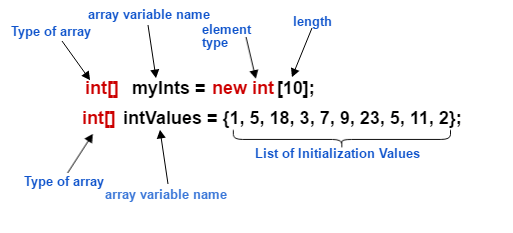
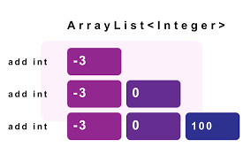
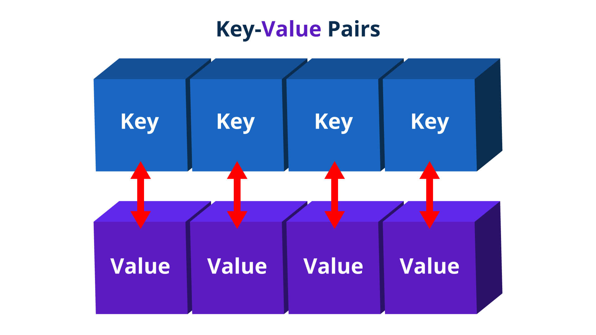

+++
title = "Java Basics 4"
type = "chapter"
weight = 60
+++

## Competency and Learning Objectives

### Competency:

Java Basics

### Learning Objectives:

- I can use built-in collection data structures in a java application

## Introduction

When writing java applications, we sometimes need to store several values together in a single variable so that they
can be processed together. In this lesson, we will learn how to use several collection types offered by Java.

## Arrays

THe most basic collection type in Java is the array.

An array is a data structure that can store multiple values of the same type together in a single variable. Each value
in an array is called an element, and each element is accessed by its index. The index of an element is a number that
represents the position of the element in the array. The first element in an array has an index of 0, the second element
has an index of 1, and so on.

Here is an example of how to declare and initialize an array in Java:

```java
...
int[] numbers = new int[5];
numbers[0] = 10;
numbers[1] = 20;
numbers[2] = 30;
numbers[3] = 40;
numbers[4] = 50;
...
```

In this example, we declare an array of integers called `numbers` that can store 5 integers. We then assign values to
each element of the array using the index notation `numbers[index]`.

Notice that the size of the array is specified when the array is declared. Once an array is created, its size cannot be
changed. If you need to store more values than the size of the array, you will need to create a new array with a larger
size and copy the values from the old array to the new array.

Let's look at another way to declare and initialize an array in Java:

```java
...
int[] numbers = {10, 20, 30, 40, 50};
...
```

In this example, we declare an array of integers called `numbers` and initialize it with the values 10, 20, 30, 40,
and 50. This is the same as the previous example, but it is more concise.



As you saw when setting the values of the array, you can access the elements of an array using the index notation
`numbers[index]`. Here is an example of how to access the elements of an array:

```java
...
int firstNumber = numbers[0]; // firstNumber is 10
int secondNumber = numbers[1]; // secondNumber is 20
...
```

However, it is much more common to access the elements of an array using a loop. Here is an example of how to iterate
over the elements of an array using a `for` loop:

```java
...
for (int i = 0; i < numbers.length; i++) {
    System.out.println(numbers[i]);
}
...
```

We can also use the enhanced for loop to iterate over the elements of an array:

```java
...
for (int number : numbers) {
    System.out.println(number);
}
...
```

This is a more convenient and concise way to iterate over the elements of an array when you don't need the index of
each element.

### Check For Understanding 1

- Question/Exercise: What is the index of the last element in a ten element array?
- Expected Output/Answer: 9
- Common Misconceptions to Address: The index of the last element in an array
is always one less than the size of the array. This is because array indices
always start at 0.

## ArrayLists



While arrays are fast, and fundamental to the language, they have some limitations. One of the main limitations of
arrays is that their size is fixed once they are created.  They are not good collections for cases where you either
don't know the number of elements ahead of time, or you expect to add/remove items from the collection.  For these
cases, Java provides a more flexible collection called an ArrayList. An ArrayList is a resizable array that can grow or
shrink in size as needed.

ArrayLists are a **Generic Type** in Java. This means that it's time name includes a type parameter that specifies the
type of elements that the ArrayList can hold.

For example, an ArrayList of Strings is declared as follows:

```java
...
ArrayList<String> names = new ArrayList<String>(); 
...
```

We can add elements to an ArrayList using the `add` method:

```java
...
names.add("Alice");
names.add("Bob");
names.add("Charlie");
...
```
We can also remove elements from an ArrayList using the `remove` method.  This
method takes either the index of the element to remove, or the element itself:

```java
...
names.remove(0);    // Removes the first element
names.remove("Bob"); // Removes the element "Bob"
...
```

We can access elements in an ArrayList using the `get` method:

```java
...
String name = names.get(1); // Gets the second element
...
```

However, we typically use the enhanced for loop to iterate over the elements in
an ArrayList as we are usually interested in all the elements in the collection:

```java
...
for (String name : names) {
    System.out.println(name);
}
...
```

While we have gone over the basics of working with ArrayLists, there are many
other methods available for working with ArrayLists.  You can find more
information in the
[Java ArrayList documentation](https://docs.oracle.com/en/java/javase/11/docs/api/java.base/java/util/ArrayList.html).

### Check For Understanding 2

- Question/Exercise: What is the main benefit of using an ArrayList over an array?
- Expected Output/Answer: The size of an ArrayList can grow or shrink as needed, while the size of an array is fixed
once it is created.
- Common Misconceptions to Address:  It is important to understand the difference between arrays and ArrayLists, and
when to use each.

## HashMaps

HashMaps are another useful collection in Java. A HashMap is a data structure
that stores key-value pairs. Each key in a HashMap is unique, and it is used to
retrieve the corresponding value.

One way to think of a HashMap is that it is like an array/arraylist, but instead
of using an integer index to access the elements, you can use any type you want for
the indexes as well as the values.  For example, you could have a HashMap of ages 
that uses a `String` representing a person's name as the key, and an `Integer` for 
the person's age as the value.



Like the `ArrayList`, the `HashMap` is a **Generic Type** in Java. In this case, it is 
generic type that takes two type parameters: one for the key type, and one for the value type.

Here is an example of how to declare and initialize a HashMap in Java:

```java
...
HashMap<String, Integer> ages = new HashMap<String, Integer>();
```

We can add key-value pairs to a HashMap using the `put` method:

```java
...
ages.put("Alice", 30);
ages.put("Bob", 25);
ages.put("Charlie", 35);
ages.put("Alice", 31); // Updates the value for the key "Alice"
...
```

Notice that there are a few important differeces when adding an item to a `HashSet` vs. an `ArrayList`:

1. We use the `put` method instead of the `add` method.
2. We provide both the key(index) and the value when adding an item to a `HashMap`.
3. If we add a key-value pair to a `HashMap` where the key already exists, the value is updated to the new value.
(`put` is both an add and an update operation).

An important "under-the-hood" characteristic of a `HashMap` is that they are implemented using a technique called
hashing. This allows for very fast lookups of values based on their keys.  When you ask for the value of a specific
key, the `HashMap` uses the key's hash code to quickly find the value associated with that key.


We can access the value associated with a key in a HashMap using the `get` method:

```java
...
int age = ages.get("Bob");
...
```

We can also remove key-value pairs from a HashMap using the `remove` method and providing the key:

```java
...
ages.remove("Charlie");
...
```

While `HashMaps` are usually accessed using the key, we can also iterate over the key-value pairs in a `HashMap` using
the enhanced for loop:

```java
...
for (Map.Entry<String, Integer> entry : ages.entrySet()) {
    String name = entry.getKey();
    int age = entry.getValue();
    System.out.println(name + " is " + age + " years old");
}
...
```

Notice that we use the `entrySet` method to get a set of key-value pairs in the `HashMap`. Each key-value pair is
represented as a `Map.Entry` object, which contains the key and the value.  This is a bit more complex than iterating
over the other collection types because we are iterating over a collection of key-value pairs, rather than just the
values themselves.

### Check For Understanding 3

- Question/Exercise: What is the main difference between an ArrayList and a HashMap?
- Expected Output/Answer: An ArrayList is a collection of elements that can be accessed by index, while a HashMap is a
collection of key-value pairs that can be accessed by key.

## HashSets 

HashSets are another useful collection in Java. A HashSet is a collection that
stores unique elements. This means that you cannot have duplicate elements in a
HashSet. If you try to add an element to a HashSet that is already in the
HashSet, the add operation will have no effect.

In a sense, you can think of a `HashSet` as a `HashMap` that only has the key part.


Like the `ArrayList` and `HashMap`, the `HashSet` is a **Generic Type** in Java.

Here is an example of how to declare and initialize a HashSet in Java:

```java
...
HashSet<String> names = new HashSet<String>();
...
```

We can add elements to a HashSet using the `add` method:

```java
...
names.add("Alice");
names.add("Bob");
names.add("Charlie");
names.add("Alice"); // This will have no effect
...
```

We can remove elements from a HashSet using the `remove` method:

```java
...
names.remove("Bob");
...
```

We can iterate over the elements in a HashSet using the enhanced for loop:

```java
...
for (String name : names) {
    System.out.println(name);
}
...
```

However, the usual purpose of a `HashSet` is to build a set of unique items and
then to later check if a specific element is in the set.  We can do this using
the `contains` method:

```java
...
boolean containsAlice = names.contains("Alice"); // true
boolean containsDave = names.contains("Dave"); // false
...
```

### Check For Understanding 4

- Question/Exercise: What is the main purpose of a HashSet?
- Expected Output/Answer: A HashSet is used to store unique elements and to
quickly check if a specific element is in the set.
- Common Misconceptions to Address:  A HashSet is not used to store elements in
a specific order, or to access elements by index.

## Sharing Task

- Activity Description:
- Prompt: Brainstorm an example of when you would use an array, an ArrayList, a HashMap, and a HashSet in a Java
- Format (individual, pair programming, presentation, group discussion, etc.): Group Discussion
- Tools: Paper and Pen
- Time Estimate: 10 minutes
- Expected Outcomes: 
    - **Green**: Students can identify scenarios where each collection type would be useful.
    - **Yellow**: Students can identify scenarios where some collection types would be useful, but not others.
    - **Red**: Students struggle to identify scenarios where each collection type would be useful.

## Practice/Project Task

- Activity Description:
- Prompt:
- Format (individual, pair programming, presentation, group discussion, etc.):
- Tools:
- Time Estimate:
- Expected Outcomes: 
    - **Green**:
    - **Yellow**:
    - **Red**:

## Conclusion

In this lesson, we learned about arrays and collections in Java. We learned how to declare and initialize arrays, how to
access the elements of an array, and how to iterate over the elements of an array. We also learned about ArrayLists,
HashMaps, and HashSets, and how to add, remove, and access elements in these collections. Finally, we learned about the
differences between arrays and collections, and when to use each.

Knowing about these different ways to handle collections of data in Java will help you write more efficient and
flexible applications.
