+++
title = "Java Setup 2"
type = "chapter"
weight = 20
+++

## Competency and Learning Objectives

### Competency:

Intro to Java

### Learning Objectives:

- I can create a new project in IntelliJ
- I can create a new repository on GitHub
- I can connect an existing IntelliJ project to GitHub

## Introduction

A fundamental part of learning software development is taking time up front to understand the tools that you will be
working with.  This lesson explores how to create a project in IntelliJ and how to get that project synced with a
repository on our GitHub page so that we can track changes and share our work with others. This lesson assumes that you
have installed IntelliJ and Git and have a basic understanding of the purpose of these tools.

> [!Note] Refer Back Here!
> The steps in this lesson are general steps that you can always follow to create a new project in IntelliJ and connect
> it to a GitHub repository.  You can refer back to this lesson whenever you need to create a new project and connect it
> to a github repository.

## Creating a New IntelliJ Project

### Creating a New Project

Now that we have our tools set up, let’s create a new project:

1. Launch IntelliJ. 
2. If you do not immediately see the **New Project** dialog, you can bring it up by clicking the **File**
menu, and then selecting **New Project**.

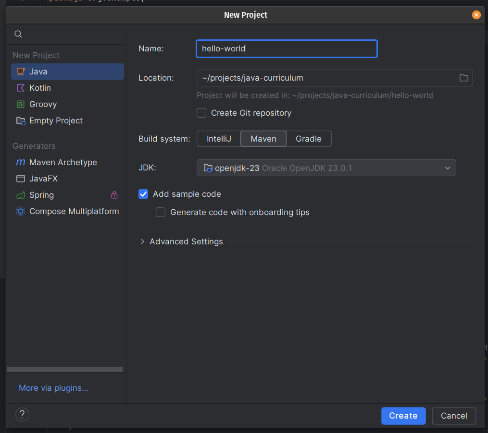

3. In this dialog, as shown, enter a name (e.g. “hello-world”) for the project, choose a location on your computer to create
the project, and choose **Maven** for the build system. 

4. A new project will be created and the main IDE window will focus showing your loaded project.

### Opening the Main File and Running the Project

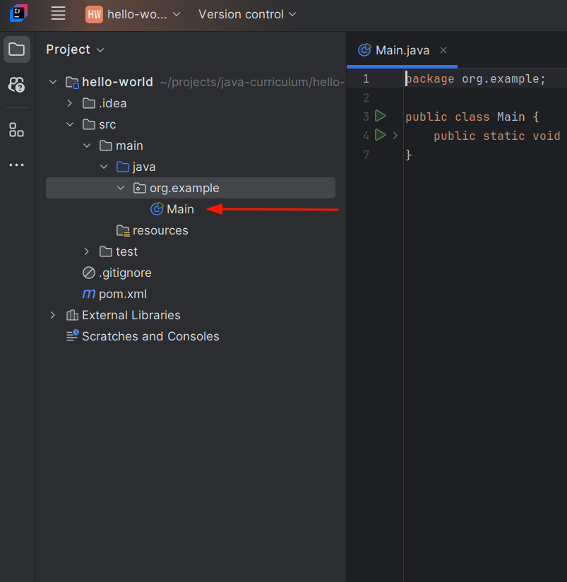

1. On the left-side of the window, the **Project Explorer** will be shown.  From here, expand folders as shown until you
find the *Main* file. 
2. Click this file to open it to the right. If you look at the content of the loaded file on the right, you will see
   that this file contains some java code for a simple program that prints the message “Hello Word” to a console screen.
3. Click the green play button in the top right of the screen to run the project.
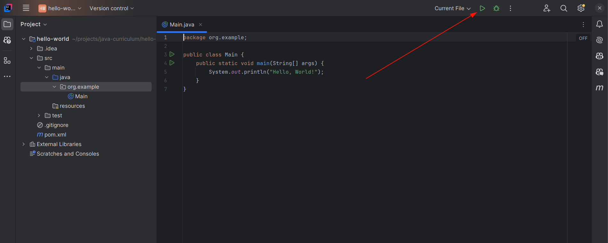
Once you run the program, a bottom pane will display showing a console with the output of the running program.

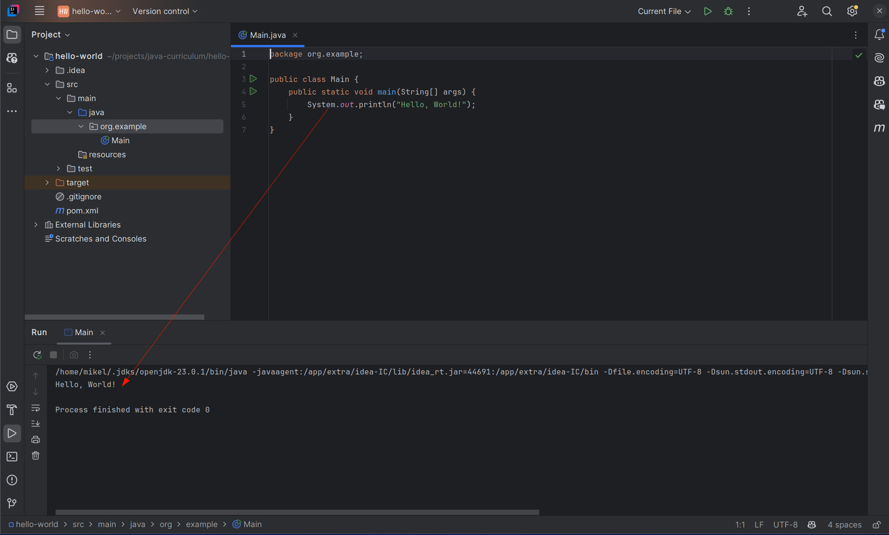

If we were to distribute this program and someone ran our final program, this output would display in a windows command
prompt (or terminal) window.  However, IntelliJ intercepts this behavior and shows the output right in the bottom IDE
tab to provide us with the easier experience of having everything in one place.

We have now successfully created a new java project and ran it with IntelliJ!  In the next section, we will connect our
project to source control to make sure that our changes are tracked and centrally backed up on the internet where we
can share our code with others.

### Check for Understanding 1

- Question/Exercise: How can we create a new project in IntelliJ now that we have already made our first project?

- Expected Output/Answer: Click the **File** menu and choose **New Project**.

- Common Misconceptions to Address: While any build system choice will work from the **New Project** dialog, it is
important that you get in the habit of choosing **Maven** as we will be exploring the build system project file later.

## Create a New Repository In GitHub

Now that we can create a java project, we should set up source control hosting for it on **github** and get our project
committed and pushed up there so we have tracking, and can share access to our code with our classmates, our teammates,
or even developers from all over the world.

1. Login to your github account and click the **New** button on the left of your github home page:

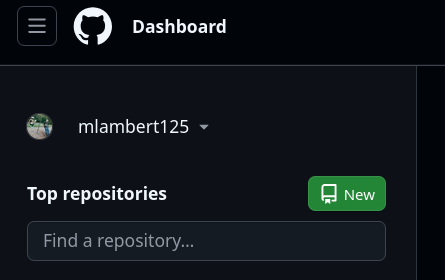

2. In the new repository dialog, enter a name for your repository, an optional description, and choose **Public** for
   the visibility.  Leave the final two options set to **none**. 

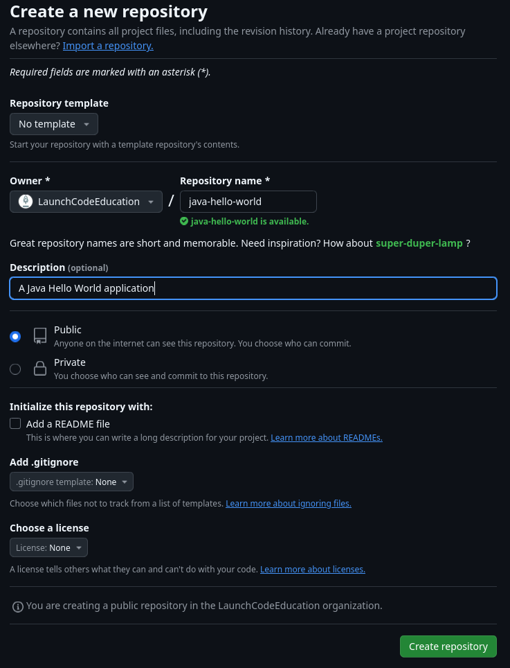

3. Click the **Create repository** to create the repository for your project.

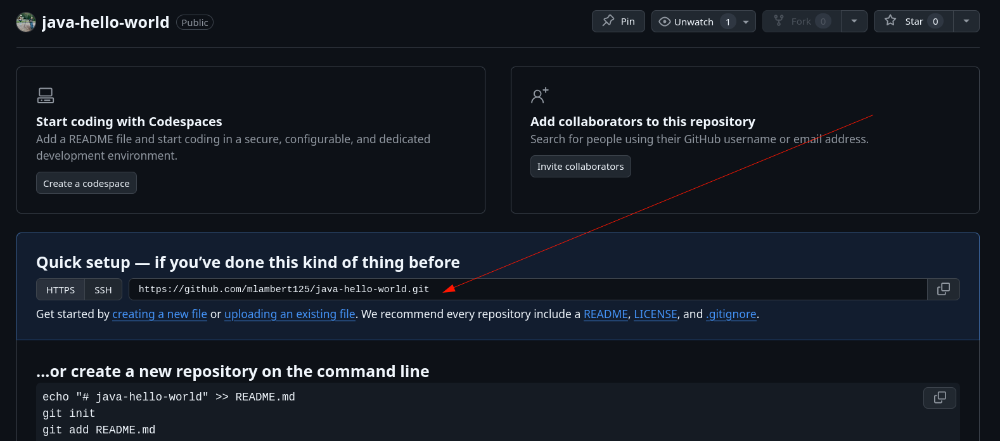

This page states that you now have an empty repository.  You can disregard the instructions on this page, as we have an
easier way to connect our IntelliJ project that will be discussed in the next section.  Leave this page open and/or
bookmark it so that you can get back to this page.  We will need the repository address information that the red arrow
points to in the image above.

### Check for Understanding 2

- Question/Exercise: What does creating a github repository for our project accomplish?

    A. Provides change tracking for our code
    B. Allows us to give others an address where they can get a copy of our code.
    C. Protects us from losing our code due to a hardware/software failure on our computer.
    D. All of the above

- Expected Output/Answer: D. All of the above

- Common Misconceptions to Address: Git and GitHub are two different things.  Git is the source control format and
software.  GitHub is a website owned by Microsoft that hosts git repositories.

## Connecting Our IntelliJ Project to the GitHub Repository

### Connecting Our Repository

Now that we have created a repository on GitHub for our project, we need to connect our project in IntelliJ to that
GitHub repository.  The easiest way to do this is to use IntellIJ’s built-in git integration. 

1. On the left of the main IntelliJ window, click the **Commit** tab (icon of a circle with a line on either side.) If
   you don't see the **Commit** options shown below (icon of a circle with a line on either side), click the **…** icon
   and choose **Commit**.

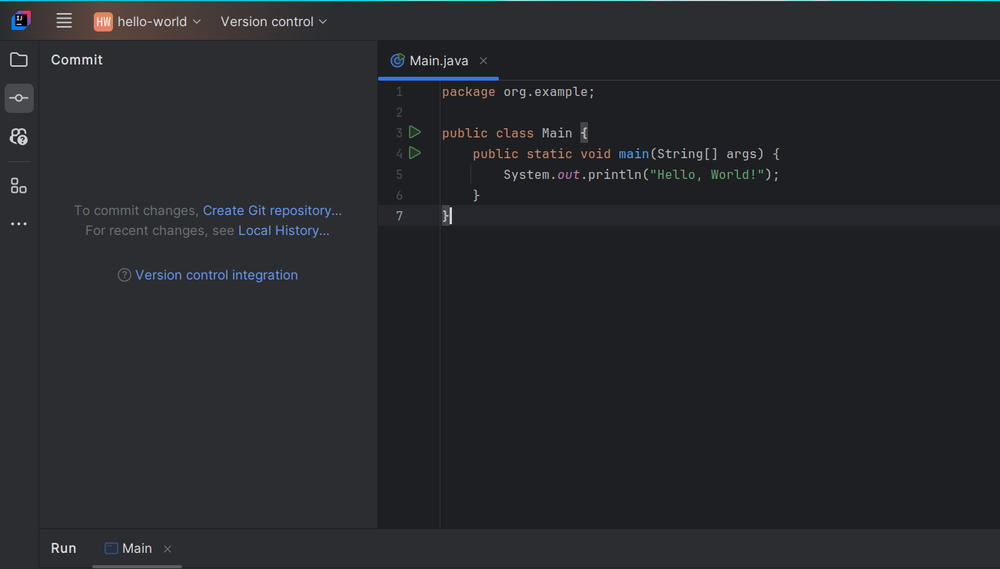

2. Once you see this tab, click **Create Git repository**, to make a local repository and bind it to our remote github
   repository.

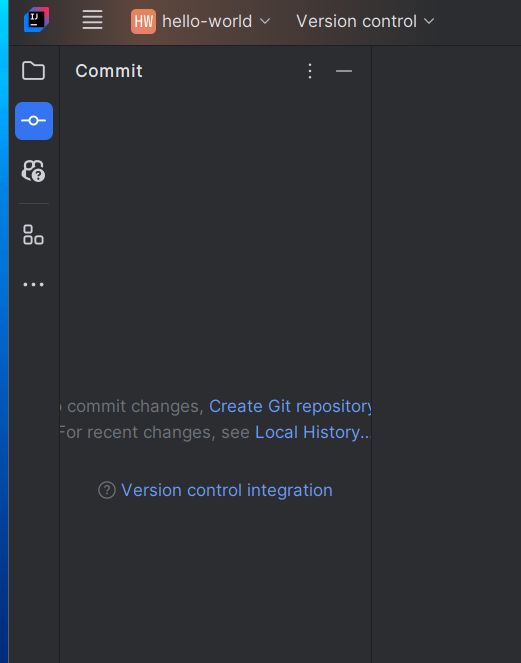

3. The dialog that is shown will default to the location of our project, which is exactly what we want.  Click the
   **OK** button.

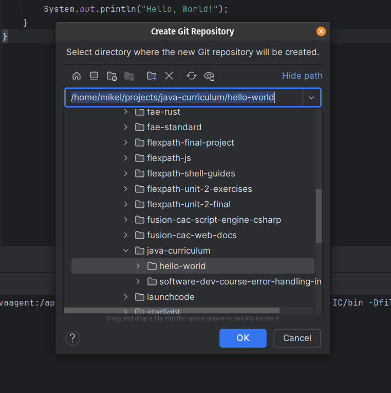

4. Back on the tab, check the top checkbox to include all of our code, enter the message “Initial Commit” (or similar)
   into the textbox and click the **Commit and Push** button. This will commit your changes and then will show a dialog
   to sync them up to the remote github repository.  The next thing to do is to tell IntelliJ where that repository is. 

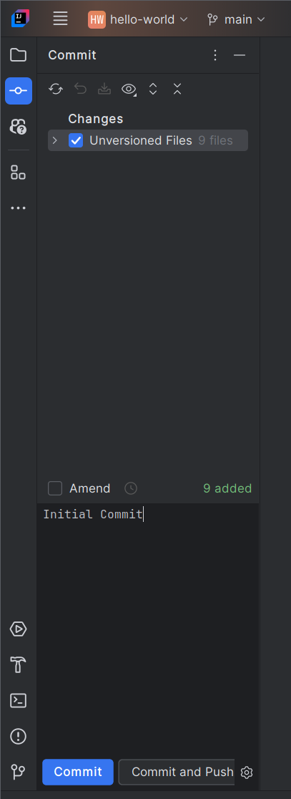

5. Click the **Define remote link** in the top-left.

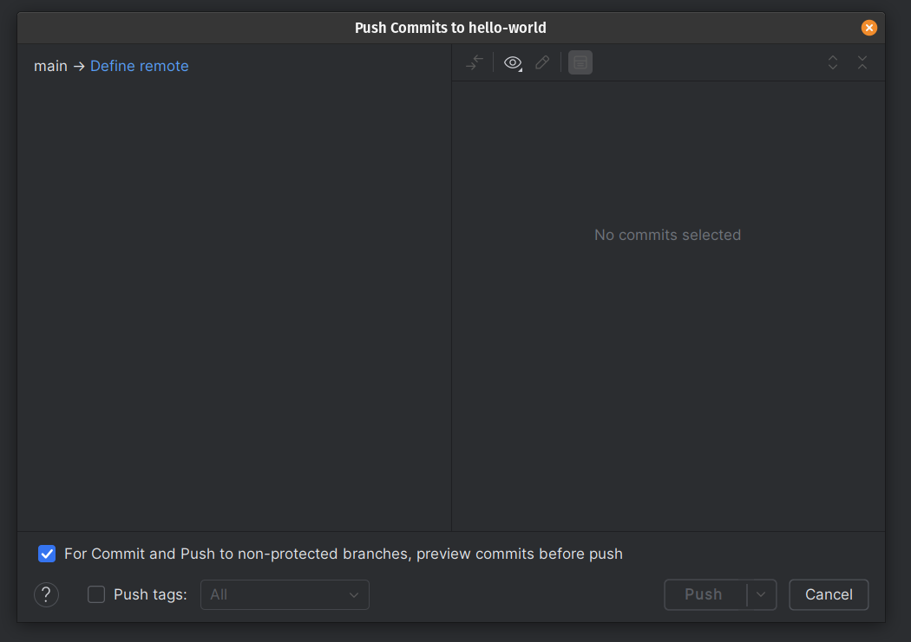

6. The default name **origin** is fine, and is what we want since other tools also treat it as default.  For the **URL**,
    you need to copy the link that we got from GitHub earlier:

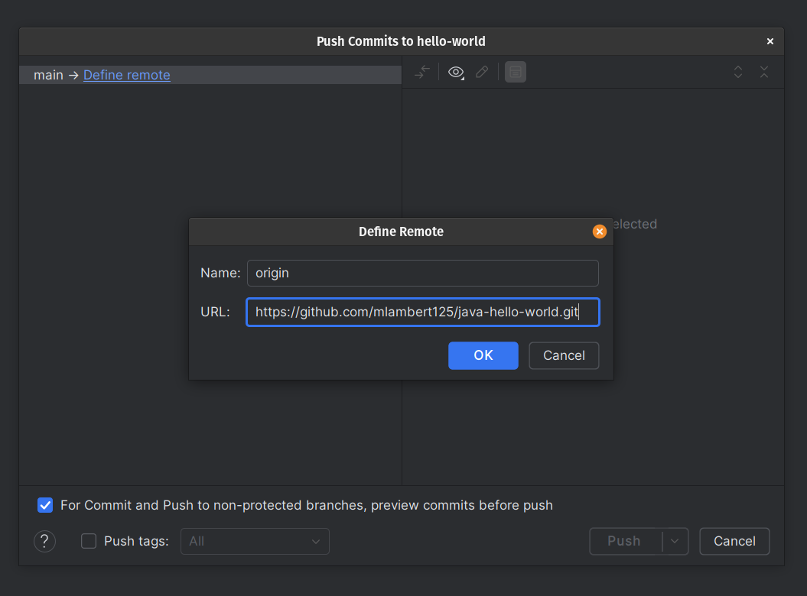

7. Click **OK** and then **Push** to sync your changes up to GitHub.  You can verify that this was
done correctly by refreshing the GitHub page.  It should now look like this:

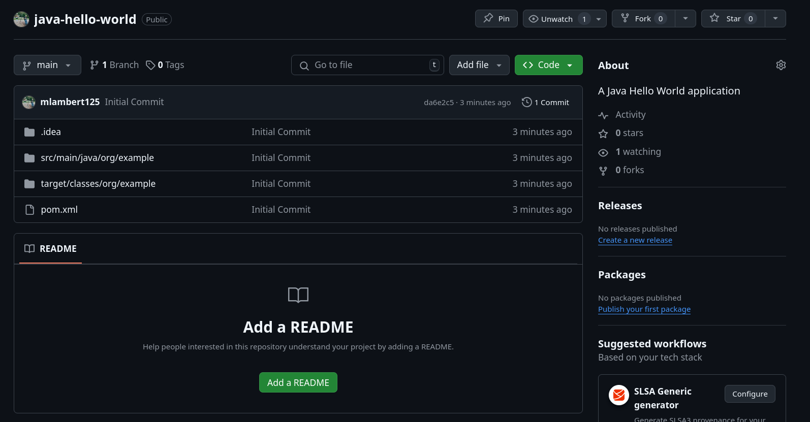

And now we have created a project and connected it to a GitHub repository!  
Click on the **Folder** button on the left pane to go back to project view.

As you work on the project, you should periodically push your changes up by returning to the **Commit** view, entering
a message and clicking **Commit and Push**.

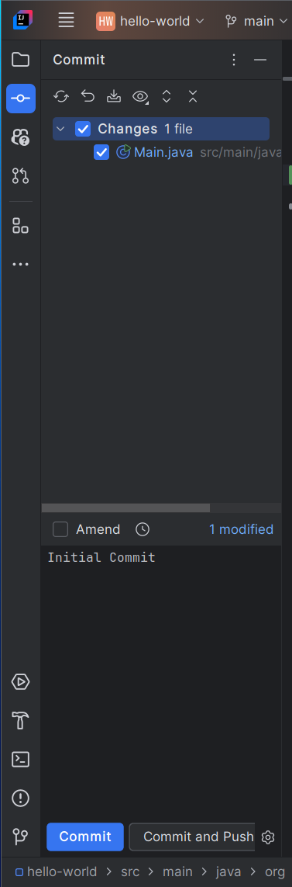

### Check for Understanding 3

- Question/Exercise: How do we switch between the **Project Explorer** and the **Commit** views in IntelliJ.

- Expected Output/Answer:  Click the folder and commit icons on the far left of the window.

## Reflection Task

- Prompt: Write a brief paragraph explaining the difference between a java **project** and a github **repository**.
How do these two relate to each other?

- Expected Outcomes: 

    - **Green**: Student properly understands that a project is a collection of java code within a folder, and a
    repository is a folder that is tracked and possibly synced with a remote copy.

    - **Yellow**: Student has a simple understanding of the distinction based on the practical distinction thus far but
    does not have any theoretical understanding.  (E.g. gives an answer like “A repository is made with git and a
    project is made with IntelliJ.”)

    - **Red**: Student can not properly distinguish a project from a repository at all.

## Practice/Project Task

- Activity Description: New Project

- Prompt: Create the new project outlined through this chapter, and connect it to a repository on your github by
following along.  Once you are done and have made your initial commit/push, modify the java program to print “Goodbye,
World!” and commit/push your changes to github.

- Format (individual, pair programming, presentation, group discussion, etc.):

- Tools: IntelliJ, GitHub website

- Time Estimate: 30 minutes

- Expected Outcomes: 

    - **Green**: Student has a Hello World GitHub repository with 2 commits.

    - **Yellow**: Student has a project locally and a repository set up, but the project is not properly synced to
    their repository for one or both commits.

    - **Red**: Student was unable to create a project, repository or both.

## Conclusion - Transition

In this lesson, we learned to create a Java project in IntelliJ, and how to create and connect a GitHub repository for
our project.  Although you may not know much about how to write java code yet, this is a major step forward!  You are
all set up to create and share work as you continue your java learning journey.  Now that we are familiar with your
basic tools, we can get into learning how to edit that Main.java file and write some java code!
