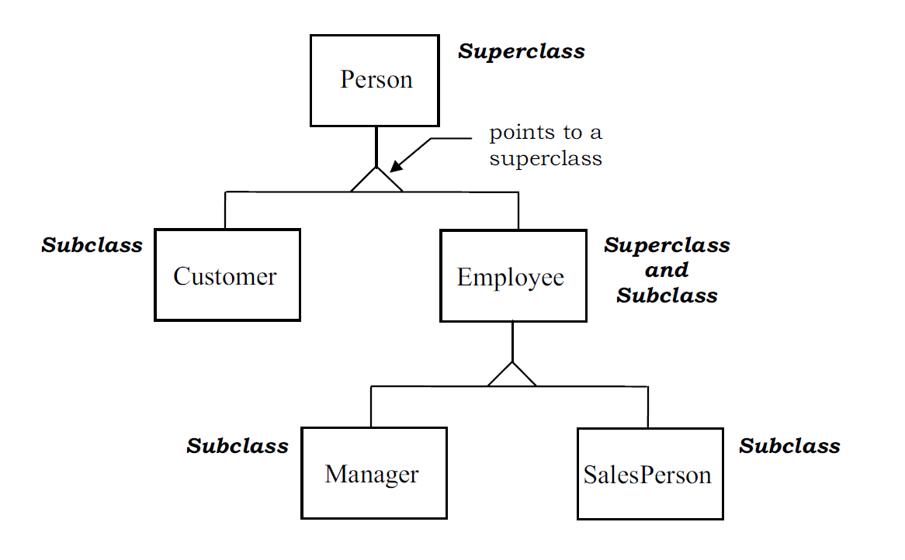

+++
title = "Oop 3"
type = "chapter"
weight = 110
+++

## Competency and Learning Objectives

### Competency:

Object Oriented Programming

### Learning Objectives:

- I can implement inheritance in java to create a class hierarchy

## Introduction

In past lessons, you have learned a great deal about how to create classes and use them to define data types with
properties and methods to group data and behavior together. In this lesson, we will learn how to use inheritance.

Inheritance is a powerful feature of object-oriented programming that allows us to create classes that *inherit*
properties and methods from other classes. This allows us to create a hierarchy of classes that share common
functionality and behavior.

Inheritance also enables a feature called *polymorphism*, which allows us to treat objects of derived classes as objects
of their base class. This means that we can use objects of derived classes in place of objects of their base class,
which can be very useful for creating flexible and extensible code.

## Basic Inheritance

Let's start by defining a simple `Person` class that represents a person with a name and age.  For the sake of 
simplicity, we will make our members public, though in practice, we would want to use private members with public
getters and setters.

>[!Note]
> If you are following along by coding, remember as we make new classes, we have to create a new file for each class. We
> can create this file by right-clicking on the `src` folder in the project explorer, selecting `New` -> `Java Class`,
> and entering the class name. This will create a new file with the class definition where we can add our code.

```java
public class Person {
    public String name;
    public int age;
}
```

Now let's say that we want to define a more specific kind of person, a `Student`, that has a student ID in addition to
a name and age.  You may be tempted to define a new class with the same members as `Person` and add a new member for the 
student ID:

```java
// Don't do this!
public class Student {
    public String name;
    public int age;
    public int studentId;
}
```

This approach works, but it is not very efficient.  We are duplicating the code for the `name` and `age` members, which
violates the DRY (Don't Repeat Yourself) principle of software development.  If we ever need to change the way we store
or access the `name` or `age` members, we would have to make the same change in multiple places, which is error-prone
and tedious.

Instead of duplicating the code, we can use inheritance to create a `Student` class that *inherits* the `name` and `age`
members from the `Person` class.  This allows us to reuse the code for the `name` and `age` members in the `Person`
class and add the `studentId` member in the `Student` class:

```java 
// Much better!
public class Student extends Person {
    public int studentId;
}
```

Let's make one more derived class, a `Teacher`, that has a `teacherId` in addition to a name and age:

```java
public class Teacher extends Person {
    public int teacherId;
}
```

Now, in our `Main` class, we can create instances of `Person`, `Student`, and `Teacher` and access their members:

```java 
public class Main {
    public static void main(String[] args) {
        Person person = new Person();
        person.name = "Alice";
        person.age = 30;

        Student student = new Student();
        student.name = "Bob";
        student.age = 20;
        student.studentId = 12345;

        Teacher teacher = new Teacher();
        teacher.name = "Charlie";
        teacher.age = 40;
        teacher.teacherId = 67890;
    }
}
```

Notice that we can access the `name` and `age` members on a `Student` or `Teacher` object even though they are defined
in the `Person` class. This is because the `Student` and `Teacher` classes inherit from the `Person` class, which means
that they have all the members of the `Person` class in addition to their own members.

Let's add a method to the `Person` class that prints the person's name and age:

```java
public class Person {
    public String name;
    public int age;

    public void printInfo() {
        System.out.println("Name: " + name);
        System.out.println("Age: " + age);
    }
}
```

Because the `Student` and `Teacher` classes inherit from the `Person` class, they also have access a `printInfo` method
and will print the name and age of the student or teacher:

```java
public class Main {
    public static void main(String[] args) {
        Person person = new Person();
        person.name = "Alice";
        person.age = 30;
        person.printInfo();

        Student student = new Student();
        student.name = "Bob";
        student.age = 20;
        student.studentId = 12345;
        student.printInfo();

        Teacher teacher = new Teacher();
        teacher.name = "Charlie";
        teacher.age = 40;
        teacher.teacherId = 67890;
        teacher.printInfo();
    }
}
```

Methods are inherited in the same way as members, so we can define methods in the base class that are shared by all
derived classes. This allows us to reuse code and avoid duplication.  We can also create methods that are specific to
a derived class.

### Check For Understanding

1. **Question:** What happens when a class inherits from another class?
    - **Answer:** The derived class inherits all the members and methods of the base class.
2. **Question:** Why is inheritance useful in object-oriented programming? 
    - **Answer:** Inheritance allows us to reuse code, avoid duplication, and create class hierarchies that model
    real-world relationships. 

## Constructors and Inheritance

Let's add a constructor to the `Person` class that initializes the `name` and `age` members:

```java
public class Person {
    public String name;
    public int age;

    public Person(String name, int age) {
        this.name = name;
        this.age = age;
    }
    ...
}
```

Now, when we create a `Person` object, we must pass the `name` and `age` as arguments to the constructor.  However,
this creates a problem for the `Student` and `Teacher` classes, because since they inherit from the `Person` class,
they must also call the `Person` constructor when they are created.

When we put the constructor on the `Person` class, we are telling Java that to make a `Person` object, we **must**
provide a `name` and `age`.  This means that when we create a drived `Student` or `Teacher` object, we must also
provide a `name` and `age`.

The first thing that we need to add is a constructor to the `Student` class that calls the `Person` constructor with
the `name` and `age` arguments.  We call the parent class constructor with the `super` keyword.  This lets us pass
the same arguments to the parent class as we would if we were creating a `Person` object with the `new` keyword:

```java
public class Student extends Person {
    public int studentId;

    public Student() {
        super("", 6);
    }
}
```

This fixes our problem, but it is not ideal because we are hardcoding the `name` and `age` arguments to the `Person`
constructor as empty strings and `6`.  Instead, we can define a constructor in the `Student` class that takes the 
`name`, `age`, and `studentId` as arguments and calls the `Person` constructor with the `name` and `age` arguments,
and then initializes the `studentId` member for itself:

```java
public class Student extends Person {
    public int studentId;

    public Student(String name, int age, int studentId) {
        super(name, age);
        this.studentId = studentId;
    }
}
```

With this change in place, we can create a `Person` object by passing the `name` and `age`, and we can create a
`Student` object by passing the `name`, `age`, and `studentId`:

```java 
...
Person person = new Person("Alice", 30);
Student student = new Student("Bob", 20, 12345);
...
```

### Check For Understanding

1. **Question:** Why do derived classes need to call the constructor of the base class?
    - **Answer:** Derived classes need to call the constructor of the base class to meet the requirements of the base
    class constructor
2. **Question:** How do you call the constructor of a base class from a derived class?
    - **Answer:** You use the `super` keyword to call the constructor of the base class with the appropriate arguments.

## Private and Protected Members

Let's look at what happens when we add a private member to the `Person` class:

```java
public class Person {
    public String name;
    public int age;
    private String address;

    ...
}
```

We know that we can not access `private` members from outside the class (i.e. from the `Main` class, we can not create
a `Person` object and access the `address` member).  However, what happens when we try to access the `address` member
from a derived class?

```java
public class Student extends Person {
    public int studentId;

    public Student(String name, int age, int studentId) {
        super(name, age);
        this.studentId = studentId;
        this.address = "123 Main St"; // Error: address has private access in Person
    }
}
```

This will cause an error as well.  Private means that we can *only* access the member from within the exact class where
it is defined.  This means that we can not access private members from derived classes, even though they inherit them.

We could create a method in the `Person` class that uses the `address` member.  But we can not access the `address`
member from the `Student` class directly.

So what if we want something in between `public` and `private`?  That is, we want a member that is accessible from
the base class and derived classes, but not from outside the class.  This is where the `protected` access modifier comes
in.  A `protected` member is accessible from the class where it is defined and from derived classes, but not from
outside the class.

Let's change the `address` member to `protected`:

```java
public class Person {
    public String name;
    public int age;
    protected String address;

    ...
}
```

Now we can access the `address` member from the `Student` class:

```java
public class Student extends Person {
    public int studentId;

    public Student(String name, int age, int studentId) {
        super(name, age);
        this.studentId = studentId;
        this.address = "123 Main St"; // No error any more!
    }
}
```

Most of the time, when we are designing class heirarchies, we avoid `private` members in favor of `protected` members,
since we are usually primarily concerned with isolating access to members from outside the class, rather than from
derived classes.

### Check For Understanding

1. **Question:** What is the difference between `private`, `protected`, and `public` access modifiers?
    - **Answer:** `private` members are only accessible from within the class where they are defined, `protected`
    members are accessible from the class where they are defined and from derived classes, and `public` members are
    accessible from anywhere.
2. **Question:** When designing class hierarchies, which access modifier is usually preferred for members that need to
   be accessible from derived classes, but not from outside the class heirarchy?
    - **Answer:** `protected`

## Method Overriding

In past lessons, you learned about method overloading, which allows us to define multiple methods in a class with the
same name but different numbers or types of parameters.  In this lesson, we will learn about method overriding, which
allows us to define a method in a derived class with the same name and signature as a method in the base class.

Let's add a `greet` method to the `Person` class that prints a greeting with the person's name and age:

```java
public class Person {
    ...

    public void greet() {
        System.out.println("Hello, my name is " + name + " and I am " + age + " years old.");
    }
}
```

Now let's add a `greet` method to the `Student` class that prints a greeting with the student's name, age, and student ID:

```java
public class Student extends Person {
    ...

    public void greet() {
        System.out.println("Hello, my name is " + name + " and I am " + age + " years old. My student ID is " + studentId + ".");
    }
}
```

For the `Teacher` class, we will not add a `greet` method, so it will inherit the `greet` method from the `Person`
class.

Now, let's look at what happens when we call the `greet` method on a `Person`, `Student`, and `Teacher` object:

```java
public class Main {
    public static void main(String[] args) {
        Person person = new Person("Alice", 30);
        person.greet();
        // Output: Hello, my name is Alice and I am 30 years old.

        Student student = new Student("Bob", 20, 12345);
        student.greet();
        // Output: Hello, my name is Bob and I am 20 years old. My student ID is 12345.

        Teacher teacher = new Teacher("Charlie", 40, 67890);
        teacher.greet();
        // Output: Hello, my name is Charlie and I am 40 years old.
    }
}
```

When we call the `greet` method on a `Person` object, it prints the greeting defined in the `Person` class. 

When we call the `greet` method on a `Student` object, it first looks for a `greet` method in the `Student` class.
Since the `Student` class has a `greet` method, it uses that method instead of the `greet` method in the `Person` class.

When we call the `greet` method on a `Teacher` object, it first looks for a `greet` method in the `Teacher` class. Since
the `Teacher` class does not have a `greet` method, it looks for a `greet` method in the base class, the `Person` class,
and uses that method.

### Check For Understanding

1. **Question:** What is the difference between method overloading and method overriding?
    - **Answer:** Method overloading allows us to define multiple methods with the same name but different parameters,
    while method overriding allows us to define a method in a derived class with the same name and signature as a method
    in the base class.
2. **Question:** When a method is called on an object that is an instance of a derived class, what order does Java
    look for the method in the class hierarchy?
    - **Answer:** Java first looks for the method in the derived class, and if it is not found, it looks for the method
    in the base class, and then the base class of the base class, and so on.

## Polymorphism

If all of the advantages of inheritance and method overriding were not enough, there is one more powerful feature that
comes from these concepts: polymorphism.  Polymorphism allows us to treat objects of derived classes as objects of their
base class.

Let's continue with our `Person`, `Student`, and `Teacher` classes, including the `greet` method in the `Person` and
`Student` classes.

Let's make one of each:

```java
public class Main {
    public static void main(String[] args) {
        Person person = new Person("Alice", 30);
        Student student = new Student("Bob", 20, 12345);
        Teacher teacher = new Teacher("Charlie", 40, 67890);
    }
}
```

All three of these objects are instances of the `Person` class.  The last two are more specific kinds of `Person`,
but they are all `Person` objects, in that they are all either `Person` objects or objects of a derived class.

Since they are all `Person` objects even if they have a more specific type, we can treat them all as `Person` objects,
assign them to a `Person` typed variable, and put them into a `Person` typed list or array:

```java
public class Main {
    public static void main(String[] args) {
        Person person = new Person("Alice", 30);
        Student student = new Student("Bob", 20, 12345);
        Teacher teacher = new Teacher("Charlie", 40, 67890);

        List<Person> people = new ArrayList<>();
        people.add(person);
        people.add(student);
        people.add(teacher);
    }
}
```

We can loop through this list, treating each object as a `Person` object, and call the `greet` method on each one:

```java
public class Main {
    public static void main(String[] args) {
        Person person = new Person("Alice", 30);
        Student student = new Student("Bob", 20, 12345);
        Teacher teacher = new Teacher("Charlie", 40, 67890);

        List<Person> people = new ArrayList<>();
        people.add(person);
        people.add(student);
        people.add(teacher);

        for (Person p : people) {
            p.greet();
        }
    }
}
```

What happens when we run this code?  The `greet` method is called on each object in the list, and the appropriate
`greet` method is called based on the *actual* type of the object.  So when we get to the second object in the list,
the `greet` method in the `Student` class is called, just as before.  The complete output will be:

```
Hello, my name is Alice and I am 30 years old.
Hello, my name is Bob and I am 20 years old. My student ID is 12345.
Hello, my name is Charlie and I am 40 years old.
```

This is polymorphism in action.  We are treating objects of derived classes as objects of their base class, while they
still retain their specific types and behaviors at runtime.


Similary, we could define a method that takes a `Person` object as a parameter and calls the `greet` method on it:

```java
public class Main {
    public static void main(String[] args) {
        Person person = new Person("Alice", 30);
        Student student = new Student("Bob", 20, 12345);
        Teacher teacher = new Teacher("Charlie", 40, 67890);

        printGreeting(person);
        printGreeting(student);
        printGreeting(teacher);
    }

    public static void printGreeting(Person p) {
        p.greet();
    }
}
```

Even though the `printGreeting` method takes a `Person` object as a parameter, we can pass a `Student` or `Teacher`
object to it because they are also `Person` objects.  This is another example of polymorphism in action.

### The Parent of All Classes

In thinking about class hierarchies, you may wonder about classes that do not have a parent class - the kind of classes
we made before this lesson.  These classes don't have a parent class.  Or do they?

In Java, every class has a parent class, whether we define one or not.  If we do not define a parent class, Java
automatically assigns the `Object` class as the parent class.  This means that every class in Java is a subclass of the
`Object` class, and inherits all the members and methods of the `Object` class.

This means that we can make a list of `Object`s and put any object in it, since every object is an `Object`:

```java
public class Main {
    public static void main(String[] args) {
        List<Object> stuff = new ArrayList<>();
        Person person = new Person("Alice", 30);

        stuff.add("Hello");
        stuff.add(1);
        stuff.add(3.14);
        stuff.add(person);

        for (Object obj : stuff) {
            System.out.println(obj);
        }
    }
}
```

So in fact, we are *always* dealing with inheritance and polymorphism in Java, and have been all along.

### Check For Understanding

1. **Question:** What is polymorphism?
    - **Answer:** Polymorphism allows us to treat objects of derived classes as objects of their base class.
2. **Question:** What is the parent class of all classes in Java?
    - **Answer:** The `Object` class is the parent class of all classes in Java.
3. **Question:** If we put a `Student` object into a `Person` variable, what happens to the object's type?
    - **Answer:** The object retains its real type (`Student`), but is treated as a `Person` object for the purposes
    of compile type verification.

## Putting It All Together - Class Hierarchies

We can put all of these concepts together to create complex class hierarchies that model real-world relationships, and
have multiple levels of inheritance.  A class hierarchy is a set of classes that are related by inheritance, to model
a certain domain or set of relationships.

Consider the following class hierarchy:



Each square represents a class, with arrows pointing from derived classes to their base classes.

The most base class is `Person`.  Beneath that are `Employee` and `Customer`, which are more specific kinds of `Person`.
`Employee` has two derived classes, `Manager` and `SalesPerson`, which are more specific kinds of `Employee`.

In the other direction, all of these types are `Person`s, so we can treat them all as `Person`s, and put them into a
`Person` typed list or array.  `Manager` and `SalesPerson` are also `Employee`s, so we can treat them as `Employee`s
as well.

Here is what the implementation might look like:

```java
public class Person {
    public String name;
}

public class Customer extends Person {
    public int customerId;
}

public class Employee extends Person {
    public int employeeId;
}

public class Manager extends Employee {
    public String department;
}

public class SalesPerson extends Employee {
    public double commissionRate;
}
```

> [!Note]
> Each of these classes would need to be in its own file, but they are combined here for clarity.

We would probably want to add constructors and methods to these classes to make them more useful, but this gives you an
idea of how we can use inheritance to create complex class hierarchies that model real-world relationships.

### Check For Understanding

1. **Question:** What is a class hierarchy?
    - **Answer:** A class hierarchy is a set of classes that are related by inheritance, to model a certain domain or
    set of relationships.
2. **Question:** How far down can class hierarchies go in Java?
    - **Answer:** There is no limit to the number of levels of inheritance in Java.


## Practice/Project Task

- Activity Description: GitHub Project
- Prompt: Fork the [OOP 3](https://github.com/LaunchCodeEducation/software-dev-course-oop-3) project from github into
your own account, clone it to your local machine, and complete the exercises as describe in
the README.md file.  When you are finished, commit and push your changes to your forked repository.
- Format (individual, pair programming, presentation, group discussion, etc.): Individual
- Tools:  Git, GitHub, JetBrains IntelliJ IDEA
- Time Estimate: 1 hour
- Expected Outcomes: 
    - **Green**: All exercises are completed and the unit tests all pass.
    - **Yellow**: Some exercises are incomplete or some of the unit tests do not pass, but the code builds and is 
    generally correct or on the right track.
    - **Red**: The code is missing or unbuildable, and shows a lack of understanding of the concepts covered in this
    lesson.

## Sharing Task

- Prompt:  Your group has been tasked with designing a class heirarchy for representing characters in a video game.
    In this game, there are three kinds of characters: warriors, mages, and rogues.  Mages, more specifically, can be
    either fire mages or ice mages.  Each character has a name and a level, and each kind of character has specific
    abilities and attributes.  Design a class hierarchy that models these relationships, and write a short description
    of each class and its members and methods. (You do not need to write the actual code, just write or draw the
    class hierarchy and describe each class.)
- Format (individual, pair programming, presentation, group discussion, etc.): group discussion
- Tools: paper, whiteboard, or digital drawing tool

## Conclusion

In this lesson, we learned about inheritance, method overriding, and polymorphism in Java.  Inheritance allows us to
create classes that inherit properties and methods from other classes, which allows us to reuse code and create class
hierarchies that model real-world relationships.

This concludes our study of the Java language itself and marks a major milestone in your journey to becoming a
professional software developer.  We have all of the basic tools to communicate our ideas in Java, but we are going to
have to learn about a few internal libraries and frameworks to apply this language knowledge to creating real-world web
applications.

As we explore these web libraries and frameworks, we will now have our Java language knowledge to apply to understanding
how they work and how to use them.

