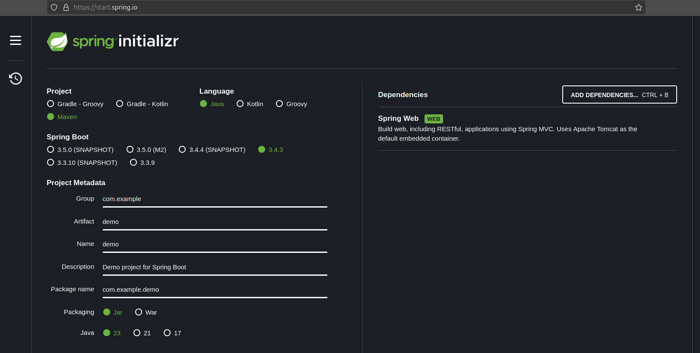
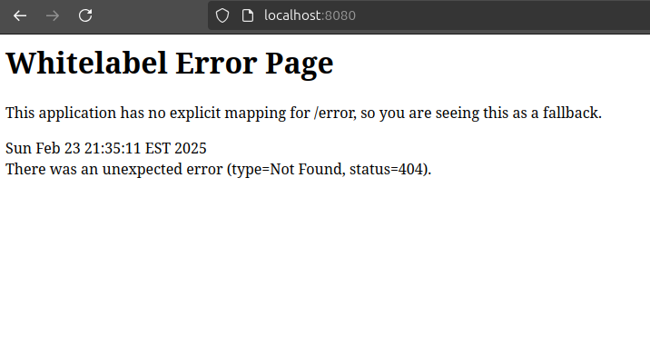

+++
title = "Spring"
type = "chapter"
weight = 140
+++

## Competency and Learning Objectives

### Competency:

Spring

### Learning Objectives:

- I can explain what a framework is within the context of software development.
- I can explain IOC and Dependency Injection.
- I can create a new Spring Boot application using Spring Initializr.

## Introduction

So far, you've likely been writing object-oriented java programs that interact with the console.  It's time to move on
to more complex applications - specifically spring web applications.  A web application is a software application that
acts as a web server and listens for incoming requests from a browser and responds with HTML or other data.

Spring is a framework that makes it easier to build web applications.  A framework is a collection of libraries and
tools that help you build software.

In this section, we will be learning about what a framework is and what dependency injection is.  We will also be
learning how to create a new Spring Boot application using Spring Initializr, which will prepare us for the next
sections where we will be learning about how to build web applications with Spring.

This section is intended to be a brief introduction to the concepts of frameworks and dependency injection.  We will be
learning more about these concepts in the next sections, so don't worry if you don't understand everything right away.
There is not a lot of code or hands-on practice in this section, but it is important to understand the concepts before
we move on to the next sections where we will be applying these concepts in practice.

## Frameworks

A framework is a collection of libraries and tools that help you build software.  A framework typically uses a technique
called inversion of control (IOC) to let you easily start up the framework and then simply write classes that customize
the behavior of the framework, and let the framework discover and apply your classes in the project automatically.

The advantage of this approach is that you do not need to write a lot of boilerplate code to start up the framework and
you do not need to write a lot of code to connect your classes to the framework.  The framework does this for you.

As we begin working with Spring, the major difference you will notice is that you will not be writing a main method
to start up your application, or dealing with the initial sequence of events that occur when your application starts up.
Instead, your application will be started up by the spring framework, and you will write classes that customize the
behavior of the framework.  The framework will discover and apply your classes in the project automatically.

### Check For Understanding

1. **Question:** What is a framework?
    - **Answer:** A framework is a collection of libraries and tools that help you build software.
2. **Question:** What is the major difference between writing an application with a framework?
    - **Answer:** You do not write the `main` method or concerning yourself with the main application, instead you
    will be writing classes that customize the behavior of the framework.
3. **Question:** What is the advantage of using a framework?
    - **Answer:** The advantage of using a framework is that you do not need to write a lot of boilerplate code to start
    up the framework and you do not need to write a lot of code to connect your classes to the framework.  The framework
    does this for you.

## Dependency Injection

Let's consider a `Car` class that has a dependency on an `Engine` class.  The `Car` class needs an `Engine` to function
properly.  In a traditional approach, the `Car` class would create an instance of the `Engine` class and use it.

```java
public class Car {
    private Engine engine;

    public Car() {
        this.engine = new Engine();
    }

    public void start() {
        engine.start();
    }
}

// elswhere:

Car car = new Car();

```

This works, but it has a few drawbacks.  First, the `Car` class is tightly coupled to the `Engine` class.  If we want
to create a new class called `ElectricEngine` that specializes the `Engine` class, we would need to modify the `Car`
class to use the new `ElectricEngine` class.  This is not ideal because it makes the `Car` class less flexible and
more difficult to maintain.

Instead, we can use a technique called dependency injection to decouple the `Car` class from the `Engine` class.  With
this technique, instead of the `Car` class creating an instance of the `Engine` class, we pass an instance of the
`Engine` class to the `Car` class through its constructor, and leave the details of how the `Engine` class is created to
the code that is creating the `Car` object.  This is called dependency injection because we are injecting the
`Engine` dependency into the `Car` class.

```java
public class Car {
    private Engine engine;

    public Car(Engine engine) {
        this.engine = engine;
    }

    public void start() {
        engine.start();
    }
}

// elswhere:
Engine engine = new Engine();
Car car = new Car(engine);
```

This approach is essential to how the Spring Framework works.  When you define a class in a Spring project, if you need
to use another class, you should not create an instance of that class in your class.  Instead, you should declare a
constructor that takes an instance of the class you need, and let Spring inject the dependency for you.  When Spring
needs to create an instance of your class, it will note the arguments to the constructor, and as long as it is aware of
the class you are asking for, it will create an instance of that class and pass it to your constructor.

### Check For Understanding

1. **Question:** What is dependency injection?
    - **Answer:** Dependency injection is a technique where instead of a class creating an instance of another class, we
      pass an instance of the class to the class through its constructor, and leave the details of how the class is
      created to the code that is creating the object.
2. **Question:** How does Spring use dependency injection?
    - **Answer:** When you define a class in a Spring, you include constructor parameters for any other classes that
      you need to use.  When Spring needs to create an instance of your class, it will note the arguments to the
      constructor and create those instances for you and pass them to your constructor.

## Spring Initializr

Spring Initializr is a web-based tool that helps you create a new Spring Boot application.  It allows you to select
what kind of application you want to create, specify which technologies you want to use, and then generates a zip file
of a project that you can download and open in IntelliJ.  This is the easiest and most common way to create a new
Spring Boot application.

You can access Spring Initializr at [start.spring.io](https://start.spring.io/).  When you go to the website, you will
see a form that allows you to specify the details of your new application.



Here is how we will use the form to create new Spring Boot applications throughout the course:

1. **Project:** Select "Maven Project" from the choices.
2. **Language:** Select "Java" from the choices.
3. **Spring Boot:** Leave the default version selected.
4. **Project Metadata:**
    - **Group:** This is the group ID for your project.  It is typically a reverse domain name that you own, such as
      `com.example`.
    - **Artifact:** This is the name of your project.  It is typically the name of your project, such as `myproject`.
    - **Group:** This is the package prefix for your project.  You can leave this as `com.example`.
    - **Name:** This is the name of your project.  It is typically the name of your project, such as `helloWorld`.
    - **Description:** This is a short description of your project.
    - **Package Name:** This is the package name for your project.  It is automatically generated based on the group and
      artifact you specified.
    - **Packaging:** Select "Jar" from the choices.
    - **Java:** Select the version of Java you are using.  It is typically the latest version of Java that you have
      installed (e.g. Java 23.)
5. **Dependencies:** Select the dependencies you want to use in your project.  For starting out, you should click on
   "Add Dependencies" and select "Spring Web" from the list.  This will add the necessary dependencies for building a
   web application with Spring.
6. **Generate:** Click on the "Generate" button to generate a zip file of your project.
7. **Unzip:** Once the zip file is downloaded, unzip it to your projects directory.
8. **Open in IntelliJ:** Open the `pom.xml` file in IntelliJ to open the project.

> [!note]
> As the course progresses, we will be adding more dependencies to our projects.  For now, we are just adding the
> "Spring Web" dependency, as this will always be a necessary dependency for building a web application with Spring.

Once you have filled out the form, click on the "Generate" button.  This will generate a zip file of your project that
your browser will begin downloading.  Once the download is complete, you will find a zip file in your `Downloads`
directory.  You can then unzip the file to your projects directory, and then open the `pom.xml` file in IntelliJ.

In this project, browse to the `src/main/java/com/example/helloWorld` directory.  You will see a file called
`HelloWorldApplication.java`.  This is the main class for your application.  It contains a `main` method that starts
up the Spring Boot application.  You can run this class to start up your application without adding any additional code.



Once the application is started, you can go to `http://localhost:8080` in your web browser and you will see a
"Whitelabel Error Page".  Contrary to what the name implies, this is not an error page.  It is a default page that
Spring Boot displays when there is no other page to display.  This is a good sign that your application is running
successfully.

In the next sections, we will be adding more code to our application to create a web application that responds to
requests from the browser.


### Check For Understanding

1. **Question:** What is Spring Initializr?
    - **Answer:** A web-based tool that helps you create a new Spring Boot application.
2. **Question:**  What is the dependency that we always add to create Spring Boot web applications?
    - **Answer:** Spring Web

## Practice/Project Task

- Activity Description: Creating a new Spring Boot application using Spring Initializr
- Prompt: Create a new Spring Boot application using Spring Initializr.  Follow the instructions in this section to
    create a new project.  Once you have created the project, run the application and verify that it is running
    successfully.
- Format (individual, pair programming, presentation, group discussion, etc.): Individual
- Tools: Browser, IntelliJ
- Time Estimate: 30 minutes
- Expected Outcomes: 
    - **Green**: Student is able to create a new Spring Boot application using Spring Initializr and run the application
      successfully.
    - **Yellow**: Student created a new Spring Boot application using Spring Initializr, but was not able to run the
      application successfully or failed to choose appropriate options to create a project.
    - **Red**: Student was not able to create a new Spring Boot application using Spring Initializr.

## Sharing Task

- Prompt:  Prepare a how-to guide/presentation on using Spring Initializr for a team that is new to Spring Boot.  Your
    guide should cover creating a basic Spring Boot web application as described in this section.
- Format (individual, pair programming, presentation, group discussion, etc.): Presentation
- Tools: Google Slides, PowerPoint, or other presentation software

## Conclusion

In this section, we learned about what a framework is and what dependency injection is.  We also learned how to create a
new Spring Boot application using Spring Initializr.  In the next sections, we will be learning about how to build web
applications with Spring.

