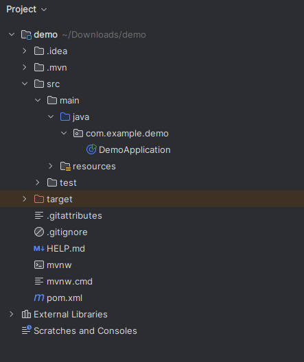

+++
title = "Springboot 1"
type = "chapter"
weight = 150
+++

## Competency and Learning Objectives

### Competency:

Spring Boot

### Learning Objectives:

- I can define the three components of MVC architecture and explain their importance.
- I can initialize a Spring Boot application.

## Introduction

## Our First Spring Boot Web Application (Hello World!)

Let's pick up where we left off in the previous lesson.  We will be using Spring Boot to create a web application that
will display a simple "Hello World" message on the screen.  We will be using the Spring Boot Initializr to create our
project.  Here are the steps from last lesson on how to use the Spring Boot Initializr web application to create a new
Spring Boot Web Application project:

1. **Project:** Select "Maven Project" from the choices.
2. **Language:** Select "Java" from the choices.
3. **Spring Boot:** Leave the default version selected.
4. **Project Metadata:**
    - **Group:** This is the group ID for your project.  It is typically a reverse domain name that you own, such as
      `com.example`.
    - **Artifact:** This is the name of your project.  It is typically the name of your project, such as `myproject`.
    - **Group:** This is the package prefix for your project.  You can leave this as `com.example`.
    - **Name:** This is the name of your project.  It is typically the name of your project, such as `helloWorld`.
    - **Description:** This is a short description of your project.
    - **Package Name:** This is the package name for your project.  It is automatically generated based on the group and
      artifact you specified.
    - **Packaging:** Select "Jar" from the choices.
    - **Java:** Select the version of Java you are using.  It is typically the latest version of Java that you have
      installed (e.g. Java 23.)
5. **Dependencies:** Select the dependencies you want to use in your project.  For starting out, you should click on
   "Add Dependencies" and select "Spring Web" from the list.  This will add the necessary dependencies for building a
   web application with Spring.
6. **Generate:** Click on the "Generate" button to generate a zip file of your project.
7. **Unzip:** Once the zip file is downloaded, unzip it to your projects directory.
8. **Open in IntelliJ:** Open the `pom.xml` file in IntelliJ to open the project.

Once you have created your project, and loaded it into IntelliJ, you will see a file structure that looks like this:



### Controllers Package

In Spring Boot, a controller is a class that handles HTTP requests and responses.  It is responsible for processing
the request, performing any necessary business logic, and returning a response to the client.  Controllers are typically
stored under a `controllers` package in your project.  The first thing that we will typically do in a Spring Boot
Web Application is to add a `controllers` package to our project.  This is where we will store our controller classes.

Right click on the `src/main/java` folder in your project and select "New" -> "Package".  Name the package
`com.example.helloworld.controllers`.  This is where we will store our controller classes.


### Hello World Controller

Now that we have our `controllers` package, we can create our first controller class.  Right click on the newly created
`controllers` package and select "New" -> "Java Class".  Name the class `HelloWorldController`.  This is where we will
create our first controller class.  This class will handle HTTP requests and return a response to the client.

Enter the following code into the `HelloWorldController` class:

```java
package com.example.helloworld;
import org.springframework.web.bind.annotation.*;

public class HelloWorldController {
    public String hello() {
        return "Hello World!";
    }
}
```

Most of this code will look very familiar.  We have added an import statement for the
`org.springframework.web.bind.annotation` package.  This package contains the annotations that we will use to define our
controller.

### Spring Boot Annotations

Spring Boot uses annotations to define the behavior of a class.  Annotations are special markers that can be added to
classes, methods, and fields to provide additional information about the class.  In Spring Boot, we use annotations to
define the behavior of our controllers. 

The first annotation that we will add is the `@RestController` annotation. This annotation tells Spring Boot that this
class is a controller and that it will be handling HTTP requests.  By adding this annotation to our class, Spring Boot
knows to consider this class as a controller and to look for methods that will handle HTTP requests.

This is how our `HelloWorldController` class looks with this annotation added:

```java
package com.example.helloworld;
import org.springframework.web.bind.annotation.*;

@RestController
public class HelloWorldController {
    public String hello() {
        return "Hello World!";
    }
}
```

The annotation starts with the `@` symbol and is followed by the name of the annotation, and appears on the line
above the class or method declaration that it applies to.

Some annotations also include parameters that can be used to customize the behavior of the annotation.  The next
annotation that we will add is the `@GetMapping` annotation.  This annotation tells Spring Boot that this method
will be handling HTTP GET requests.  We will add this annotation to our `hello` method.  This annotation in
conjunction with the `@RestController` annotation will tell Spring Boot that this method will be handling HTTP GET
requests and that it will be returning a response to the client.  

The `@GetMapping` annotation also includes a parameter that specifies the URL path that this method will be handling
`GET` requests for.  We will set this parameter to `/hello`.  This means that when a client makes a `GET` request to
`http://localhost:8080/hello`, this method will be called and the response will be returned to the client in the
response body.

Here is the final version of our `HelloWorldController` class:

```java
package com.example.helloworld;
import org.springframework.web.bind.annotation.*;

@RestController
public class HelloWorldController {
    @GetMapping("/hello")
    public String hello() {
        return "Hello World!";
    }
}
```

This class is now a fully functional Spring Boot controller.  We can now run our application and open a web browser to
`http://localhost:8080/hello` to see the response from our controller.  You should see the message "Hello World!" in
the browser.  This is the response that our controller is returning to the client.

### Check For Understanding

1. **Question:**  What is the purpose of a controller in Spring Boot?
    - **Answer:**  To handle HTTP requests and responses.
2. **Question:**  What is the purpose of the `@RestController` annotation?
    - **Answer:** To tell Spring Boot that this class is a controller and that it will be handling HTTP requests.
3. **Question:**  What is the purpose of the `@GetMapping` annotation?
    - **Answer:**  To tell Spring Boot that this method will be handling HTTP GET requests, and to specify the URL path
      that this method will be handling `GET` requests for.

## Returning HTML from a Controller

In the previous section, we created a controller that returned a simple "Hello World!" message in the response body.  In
the browser, you saw a plain text response.  However, in a real web application, we would typically want to return HTML
in the response body so that we can display the response in a web page.  In this section, we will modify our controller
to return HTML in the response body.

To return HTML in the response body, we can simply modify the `hello` method to return a string that contains HTML
markup.  Here is an example of how we can modify our `hello` method to return HTML in the response body:

```java
package com.example.helloworld;
import org.springframework.web.bind.annotation.*;

@RestController
public class HelloWorldController {
    @GetMapping("/hello")
    public String hello() {
        return "<html><body><h1>Hello World!</h1></body></html>";
    }
}
```

We can make this look a little nicer by using a raw string.  A raw string is a string that is enclosed in three
quotes (`"""`).  This allows us to include line breaks and other special characters (including quotes) in the string
without having to escape them.  Here is an updated example of our `hello` method that uses a raw string:

```java
package com.example.helloworld;
import org.springframework.web.bind.annotation.*;

@RestController
public class HelloWorldController {
    @GetMapping("/hello")
    public String hello() {
        return """
            <html>
                <head>
                    <title>Hello World</title>
                </head>
                <body>
                    <h1 style="color: red">Hello World</h1>
                </body>
            </html>
            """;
        }
}
```

If you load the url `http://localhost:8080/hello` in your browser, you should see the message "Hello World!" in red
text.  This is the HTML that our controller is returning in the response body.  We now have a fully functional web
server delivering HTML content to the browser.

> [!NOTE] Templating HTML

> In practice, one would not typically return HTML directly from a controller.  Instead, we would use a template engine
> to generate the HTML dynamically.  This course is focused on using Spring Boot to build web apis, so we will not be
> covering template engines or server-side rendering of HTML in this course.

### Check For Understanding

1. **Question:**  How can we return HTML in the response body from a controller?
    - **Answer:**  By returning the HTML markup as a string from the controller method.

## Returning Complex Data Types From a Controller

In the previous sections, we learned to return simple strings and HTML from a controller.  However, in many real web
applications, we want to create services that return complex data types formatted as JSON, to be consumed by a
client-side javascript framework as *data* rather than an HTML view.

Thankfully, Spring Boot makes this very easy.  We can simply return a Java object from our controller method, and Spring
Boot will automatically convert the object to JSON and return it in the response body.

### Models

When we create a more complex class for containing mutliple pieces of data in Spring Boot, we typically call this a
"model".  A model is a class that represents a data structure that we want to return from our controller.  Models are
plain old Java objects (POJOs) that contain fields with getters and setters for each field.  We can then return these
models from our controller methods, and Spring Boot will automatically convert them to JSON and return them in the
response body.

Let's create a simple model class that we can use to return data from our controller.  Right click on the
`com.example.helloworld` package and select "New" -> "Package".  Name the package `models`.  This is where we will
store our model classes.  Right click on the `models` package and select "New" -> "Java Class".  Name the class
`Student`.  This is where we will create our first model class.  This class will represent a student with a name and
an grade between 0 and 100.  Here is the code for our `Student` class:

```java
package com.example.helloworld.models;

public class Student {
    private String name;
    private int grade;

    public Student(String name, int grade) {
        this.name = name;
        this.grade = grade;
    }

    public String getName() {
        return name;
    }

    public void setName(String name) {
        this.name = name;
    }

    public int getGrade() {
        return grade;
    }

    public void setGrade(int grade) {
        this.grade = grade;
    }
}
```

This is just a simple Java class with two fields: `name` and `grade`.  We have also added getters and setters for
these fields, as well as a constructor that takes the name and grade as parameters.  This is a typical structure for a
model class in Spring Boot.  We can now use this class to return data from our controller.

Let's add a new method to our `HelloWorldController` class that will return a `Student` object.  Here is the code for
our new method:

```java
import com.example.helloworld.models.Student;

...

@RestController
public class HelloWorldController {
    @GetMapping("/student")
    public Student getStudent() {
        return new Student("John Doe", 95);
    }
}
...
```

If you load the url `http://localhost:8080/student` in your browser, you should see a JSON response that looks like
this:


This is the JSON representation of our `Student` object.  This format is perfectly suited for consumption by a
client-side javascript framework, such as React or Angular which can access it by making a simple `fetch` request.

### Check For Understanding

1. **Question:**  What is a model in Spring Boot?
    - **Answer:**  A model is a class that represents a data structure that we want to return from our controller.
2. **Question:**  What is the default format that Spring Boot will use to return a complex data type from a controller?
    - **Answer:**  JSON
3. **Question:**  What is the acronym used for a Java class that contains only fields with getters and setters for each
    field?
    - **Answer:**  POJO (Plain Old Java Object)

## MVC Architecture

In the previous sections, we learned about controllers and models in Spring Boot.  Let's consider one more type of
component that is commonly used in Spring Boot applications: the view.

We have actually already seen a view in action in the previous sections.  The view is what we return to the client in
the response body.  In the previous sections, we returned a simple string, HTML, and JSON in the response body.

Put together, these three components make up the MVC architecture.  MVC stands for Model-View-Controller.

- **Model:**  The model is the data that we want to return from our controller.  This data is communicated through a
    model class, but is often loaded and populated from a database.
- **View:**  The view is what we return to the client in the response body.  It can be a simple string, HTML, or JSON,
    or an HTML page created using a template engine.  For our purposes, the view is the JSON that we return from our
    controller.
- **Controller:**  The controller is a class that handles HTTP requests and responses.  It is responsible for processing
  the request, performing any necessary business logic, and returning a response to the client.

Spring Boot Web is an **MVC framework** because it facilitates this architecture.  The MVC architecture is a common
and very powerful architecture for building web applications.  It allows us to separate the concerns of our application
into three distinct components, which makes our application easier to maintain and extend.

### Check For Understanding
1. **Question:**  What does MVC stand for?
    - **Answer:**  Model-View-Controller
2. **Question:**  What is the purpose of the model in MVC?
    - **Answer:**  The model is the data that we want to return from our controller.
3. **Question:**  What is the purpose of the view in MVC?
    - **Answer:**  The view is what we return to the client in the response body.
4. **Question:**  What is the purpose of the controller in MVC?
    - **Answer:**  The controller responds to requests, loads data from the model, and returns a view to the client.

## Reflection Task

- Prompt:
- Expected Outcomes: 
    - **Green**:
    - **Yellow**:
    - **Red**:

## Practice/Project Task

- Activity Description:
- Prompt:
- Format (individual, pair programming, presentation, group discussion, etc.):
- Tools:
- Time Estimate:
- Test Case
    - Input: 
    - Output:
- Expected Outcomes: 
    - **Green**:
    - **Yellow**:
    - **Red**:

## Sharing Task

- Prompt:
- Format (individual, pair programming, presentation, group discussion, etc.): 
- Tools:

## Conclusion

In this lesson, we learned a *lot*!   We learned how to create a Spring Boot Web Application that responds to HTTP
requests with data serialized from Model classes.  We also learned about the MVC architecture and how it is used in
Spring Boot.  We learned about java annotations and how they are used to define the behavior of the classes that make
up a Spring Boot application.

In the next section we will learn to connect our Spring Boot application to a database and how to use Spring Data JPA to
permanently store and retrieve model data from a database.


